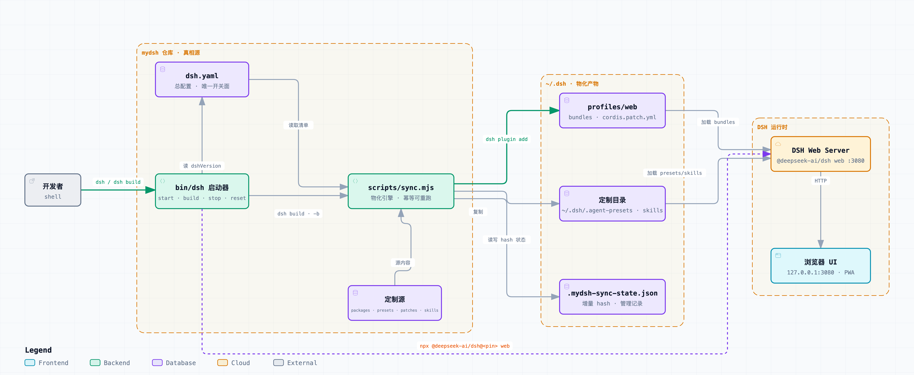

# mydsh — DSH 定制仓

本仓库是 DSH(DeepSeek Harness)的定制仓:**总配置统一管理,各项定制可插拔、独立版本、独立维护,但都在同一仓库内**。

## 真相源约定

- **仓库是唯一真相源**。`dsh.yaml` + 各定制目录 + `instructions/dsh-home.md` = 完整配置;`~/.dsh` 是物化产物。
- `cordis.patch.yml`、presets/skills 与 `$DSH_HOME/AGENTS.md` 都应从仓库修改后重新 sync。`AGENTS.md` 有 ownership/hash 漂移防护:发现未托管文件或本地改动时会报错并保留,不会静默覆盖或删除。
- **禁用 ≠ 删除**:`enabled: false` 只表示不物化,仓库内容保留,随时可重新启用。

## 目录结构

```
dsh.yaml                  # 总配置(唯一开关面)
BACKLOG.md                # 想法池
openspec/                 # spec-driven 变更流程
scripts/install.sh        # 一键安装:bin/dsh → ~/.local/bin(幂等,可卸载)
scripts/dsh.fish          # fish 旧别名(可选,见文件内注释)
scripts/sync.mjs          # manifest → ~/.dsh 物化
instructions/dsh-home.md  # 工作环境级模型指令源文件
packages/<name>/          # 自研 bundle 插件(见 packages/README.md)
presets/<id>/             # agent preset(见 presets/README.md)
patches/<id>.yml          # 纯 composition 片段 / 对 remote 包的覆盖(见 patches/README.md)
skills/<name>/            # skill(见 skills/README.md)
docs/notes/               # 可长期检索的问题与决策记录
tests/                    # sync 黑盒回归测试
```

## 架构图

<picture>
  <source media="(prefers-color-scheme: dark)" srcset="archify-out/mydsh-architecture.dark.png">
  
</picture>

> 交互版(明暗主题 / 缩放 / 导出):`archify-out/mydsh-architecture.html`;
> 矢量版:`archify-out/mydsh-architecture.dual.svg`(自带明暗主题适配)。

## 使用

**安装**(一次性;macOS / Linux / WSL / Git Bash 通用,`bin/dsh` 是 bash 脚本,Windows 原生不支持):

```bash
./scripts/install.sh
```

- 默认装到 `~/.local/bin/dsh`(想换目录:`DSH_BIN_DIR=/opt/bin ./scripts/install.sh`);重复执行可覆盖更新,不影响 `~/.dsh` 物化产物;
- 装的是**相对符号链接**,仓库整体移动后命令依然可用,无需重装;
- 若 `~/.local/bin` 不在 PATH,脚本会打印各 shell(bash/zsh/fish)的配置提示;
- 卸载:`./scripts/install.sh uninstall`;
- 不想跑脚本?在仓库根执行等价的原始命令也行:
  ```bash
  ln -s "$PWD/bin/dsh" "$HOME/.local/bin/dsh"   # fish: ln -s (pwd)/bin/dsh ~/.local/bin/dsh
  ```

**快速上手**(第一次用,照抄这三行):

```bash
dsh build   # 1. 首次:按 dsh.yaml 把定制物化到 ~/.dsh(改了配置后也要重跑)
dsh         # 2. 启动:自动在后台拉起,就绪后打开 UI
dsh stop    # 3. 停止服务
```

- 想一步到位?"构建 + 启动"用 `dsh -b`;
- 启动后 UI 在 **http://127.0.0.1:3080**(换端口:`dsh -p 8080`);
- 每次启动/停止,终端都会打印**当前加载的插件清单**,一眼看清生效了哪些定制;
- 重复执行 `dsh` 不会起第二个实例:已在运行就只是帮你把 UI 打开。

**日常命令**(按场景查):

| 场景 | 命令 | 说明 |
|---|---|---|
| 启动 | `dsh` | 未运行 → 后台拉起 + 打开 UI;已运行 → 打开 UI;UI 也已打开 → 提示"已在运行" |
| 构建 + 启动 | `dsh -b` | 改过 `dsh.yaml` 或插件后,先重新物化再启动 |
| 只构建 | `dsh build` | 只把配置物化到 `~/.dsh`,不启动 |
| 停止 | `dsh stop` | 停掉服务进程(浏览器标签请手动关) |
| 重启 | `dsh restart` | 停 → 等端口释放 → 再启动,一步到位(别用 `dsh stop & dsh`,两者会打架) |
| 看历史 | `dsh history` | 历次启动的时间 / DSH 版本 / 端口 / 插件清单(记录在 `~/.dsh/dsh-startup.log`) |
| 一键清空定制 | `dsh reset` | 移除自定义插件、preset、skill,并安全撤销托管的 `$DSH_HOME/AGENTS.md`(反悔了?`dsh build` 就能恢复) |
| 调试 | `dsh --foreground` | 前台运行,日志直接打在终端 |
| 换端口 | `dsh -p 8080` | 默认 3080 |
| 不弹 UI | `dsh --no-open` | 启动/检测时不自动打开 UI |

小知识:"build" 就是按 `dsh.yaml` 物化到 `~/.dsh`(即 `node scripts/sync.mjs`,幂等可重跑);`DSH_HOME` 未设置或只含空白时默认 `~/.dsh`,也支持 `DSH_HOME=~/...`;DSH 版本单一来源是 `dsh.yaml` 的 `dshVersion`,启动时动态读取。

**UI 打开方式**(用 `DSH_OPEN_APP` 控制,不用改 shell 配置):

- 默认:系统默认浏览器打开 `http://127.0.0.1:3080`;
- 想用 PWA 窗口 / 指定 App 打开:仓库根 `.env.local`(gitignored,模板见 `.env.local.example`)写 `DSH_OPEN_APP=...`,启动时自动生效;也可以临时 `DSH_OPEN_APP="xxx.app" dsh`(行内优先);
- 注意:自定义端口(`dsh -p`)时 PWA 打开的是自己的 start_url,可能对不上,这种情况用 `--no-open` 手动开。

sync 行为按定制类型:

| 类型 | source | 物化动作 |
|---|---|---|
| package | local | `dsh plugin add file:<packages/<id>>`(自动进 profile bundles) |
| package | remote | `dsh plugin add <spec>`(自动进 profile bundles) |
| preset | — | copy 到 `~/.dsh/.agent-presets/<id>` |
| patch | — | 按 manifest 顺序合并生成 profile `cordis.patch.yml` |
| skill | — | copy 到 `~/.dsh/skills/<id>` |

顶层 `dependencies:` = 无 bundle 的支撑包(如 remote 定制缺失的 peer),精确版本 pin 装为 plain dependency、**不进 bundle 层**;定制条目用 `deps:` 引用其包名声明归属(安装仍以顶层列表为唯一入口,sync 校验引用,悬空引用报错)。

## 环境级 instructions

顶层 `agentInstructions` 不是一种 customization type。启用时,sync 校验 `source` 是仓库内相对文件,加 GENERATED/provenance 头后原子写入 `$DSH_HOME/AGENTS.md`,并在 `.mydsh-sync-state.json` 记录来源与部署哈希。连续 build 幂等;禁用、删除字段或 `dsh reset` 时,只会删除仍匹配已部署哈希的目标。目标若已有未托管内容,或托管后被修改,sync 会保留文件并报错,要求人工决定如何处理。

DSH 官方 `standard` preset 会自动加载,无需复制出 `mydsh` preset。`$DSH_HOME/AGENTS.md` 给该 DSH 工作环境提供前馈模型指导;它不是权限授予,也不是强制安全边界,实际能力始终由最新 runtime context 与工具执行策略决定。`dsh-sandbox-notes` skill 继续保留,用于需要时查阅完整背景与恢复细节。

## 第三方定制(remote)约定

- 只存三样:**精确版本 pin**、**个人覆盖片段**(`patches/<id>.yml`)、**条目说明**(`note`/审查记录);**不 vendor 源码**。
- 升级 = 改 pin 重跑 sync;不自动漂移。
- **安全提醒**:插件即第三方代码(社区列表明示警告),安装前先看源码,`note` 记录来源与审查结论。

## 开发流

- 新想法 → `BACKLOG.md`;单项实施 → openspec change(`openspec new change <name>`);
- 自研 package 改代码后**要 bump 版本**(manifest 同步),sync 才会重装;
- DSH 升级后重跑 sync 恢复全部定制。
