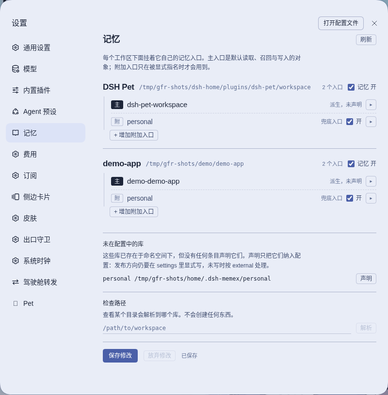

# dsh-memex

English · [简体中文](README.zh.md)

<!-- problem -->
An AI agent forgets everything when a session ends, and one shared notebook for all your projects quickly turns into noise, or leaks one project's details into another. dsh-memex gives DSH agents a persistent Zettelkasten memory that is split by project: each workspace reads and writes its own library of cards, and writes to a library that gets published are screened before they land.



**What you get**

- **Memory that survives the session.** The agent is nudged to recall at session start and to save what it learned, using [memex](https://github.com/iamtouchskyer/memex) cards that stay plain files you can sync with git or open in Obsidian.
- **One library per project, no setup.** The working directory decides which library a session uses, so a new workspace is usable immediately and unrelated projects never share a library.
- **Cross-library search when you want it.** The agent can search several libraries at once or write a second copy into another one, but only within the reach you configured.
- **A guard on anything that gets published.** Writes to an externally published library are scanned for internal scope names, domains, remotes and workspace paths.
- **A Memory settings page.** See and edit which libraries each workspace uses, switch memory off per workspace, set up remotes and open the cards in a browser, without editing files by hand.

**Install.** In an ohmydsh setup this package is managed through `dsh.yaml` (entry `dsh-memex`, `source: local`): set `enabled: true` and run `dsh build`. Setting `DSH_MEMEX_ENABLED=0` removes it at the next build. It needs the memex storage kernel as a global npm install, which `dsh` provisions for you; see [Installation and prerequisites](#installation-and-prerequisites). This README documents no standalone installation. For the surrounding repository see the [plugin index](../../README.md#plugins).

**Jump to:** [How it works](#how-it-works) · [Configuration](#configuration) · [Guard boundary](#guard-boundary) · [Installation and prerequisites](#installation-and-prerequisites) · [Development](#development)

## How it works
<!-- section: how-it-works -->

This package is structurally the DSH equivalent of the Pi extension shipped by [`@touchskyer/memex`](https://github.com/iamtouchskyer/memex): it registers the memex tool surface in-process, subscribes to the host session lifecycle, and publishes memex's bundled methodology skills. It additionally resolves each DSH Session to an isolated memex library and coordinates multi-library reads and writes. The reasoning behind running in-process instead of using memex's MCP server is in [integration-notes](docs/integration-notes.md).

### What belongs where

- **memex owns:** card format, Zettelkasten methodology, slugs, wikilinks, recall/retro/organize workflows, sync and serve.
- **DSH owns:** Sessions, tools, lifecycle events, settings and skill discovery.
- **this package owns:** cwd → scope → `MEMEX_HOME`, concurrent cross-library search, result provenance, binding limits and the external-publish write guard.

No memex source, skill, or card format is modified. See [`ATTRIBUTION.md`](ATTRIBUTION.md).

### Storage layout

Libraries live under one namespace and never reference one another. A scope is resolved from the Session's cwd in this order: a configured workspace path (longest match, on path-segment boundaries), a configured repository pattern, then derivation — from the repository's `origin` for a checkout (the last two path segments of the remote, so same-named repositories in different organizations never share a library), or from the directory's own path when it belongs to no repository:

```text
~/.dsh-memex/
  personal/               # declared: shared by the workspaces the config lists
  acme/                   # declared
  documents-learning/     # derived locally: a directory outside every repository
  example-org-project/    # derived from a remote that no entry claims
```

Every child is a standard memex home (`cards/`, optional git repository and remote). A library may be copied, synced or deleted independently. This package injects exactly one `MEMEX_HOME` per kernel call and writes no private config, index or log inside a library.

Consequences worth knowing:

- **A directory that belongs to no repository does not land in a shared library.** It gets its own, named after its last two path segments, and that library stays local: nothing is pushed anywhere until a human configures a remote for it.
- **`personal` is the fallback entry**: reachable in both directions by default, so a new workspace is usable with no configuration at all. A workspace whose entry declares `fallback: false` reaches neither reading nor writing it, and a binding that names it explicitly still can (an explicit declaration outranks a default).
- A workspace can have several entries: exactly one is the **primary** (the route: recall, graph-level operations, default reads and writes); additional entries are reachable but never touched unless a call names them. Two entries cannot share one library directory.
- A library is only materialized on the first write to it, so a repository that never touches memory never creates one.

### Tool behavior

The package registers the eight tools exposed by memex's Pi extension:

- `memex_recall`, `memex_retro`, `memex_search`, `memex_read`
- `memex_write`, `memex_links`, `memex_archive`, `memex_organize`

Names and descriptions come verbatim from the pinned memex release. Scope is implicit (`current`) unless the operation accepts an optional `scope`: only search, read and write take it, because recall and the graph-level tools (links, archive, organize) are facts about one library. Multi-library search fans out concurrently, one normal memex CLI call per library, and every hit carries the scope it came from so it can be read back. A write can also name a second library to receive a copy, within the writable reach of the session's binding. Keyword search segments runs of Han characters in the query before it reaches the kernel; no vector search is involved.

### Recall guidance and write reminder

At session start the plugin injects a bounded recall guide (the resolved scope and library, how to recall, when to write a card) before the first turn; it is read-only and a failure only logs a warning.

After a session has recalled something and not yet written a card, the plugin nudges the model to save what it learned. The nudge is delivered with the **next** turn, never inside the one that just finished, so a turn always ends on the answer to the request it was asked for. If the conversation stops after that turn, no reminder is delivered and no card is written on its own.

### Recall telemetry

Each keyword search appends one record under `$DSH_HOME/plugins/dsh-memex/` (never inside a library, never sent anywhere). A record keeps the criteria — time, scope, hit count, returned slugs, whether each hit came from `slug`/`title`/`tags` — and never the query text or card bodies. The read-only `dsh-memex-recall-report` command turns it into a report of empty results, body-only hits and cards that were never recalled:

```bash
dsh-memex-recall-report --days 14 --scope personal
```

## Configuration
<!-- section: configuration -->

Configuration is the plugin's own config, with the scope table fields editable live without remounting the plugin. The keys, as defined in `src/scope/settings.ts`:

```yaml
autoDerive: true            # derive libraries for unclaimed workspaces (default)
scopes:                     # the "memory entries"
  - name: acme              # kebab-case library name
    home: ~/path/to/library # optional; default is ~/.dsh-memex/<name>
    pathPrefixes: [~/work/acme]   # workspaces this entry claims
    remotePatterns: []      # repository remotes this entry claims
    publish: external       # internal | external (default external)
    primary: true           # needed when several entries claim the same path: exactly one
    fallback: false         # false closes the personal fallback (older entry-level form)
bindings:                   # the extra reach a scope may select; limits, never grants
  - name: acme-set
    read: [acme, personal]
    write: [acme, personal]
workspaces:                 # per-path declarations; they can only close things
  - path: ~/work/acme
    memory: false           # memory off for everything under this path
    fallback: false         # personal fallback closed for this path
```

An absent section means the schema defaults: only `personal`, auto-derive on. Invalid settings at registration prevent the plugin from publishing tools; invalid live edits are rejected and the plugin keeps using the last-good value, so an invalid draft can never change how memory is routed. A binding set bounds what an agent may additionally select: it limits rather than grants, and a workspace's own entries are always reachable. Resolution order is path prefix, then remote pattern, then auto-derivation, then the local-path fallback. The older entry-level `memory` and `fallback` fields are still read; if either the declaration or the entry closes something, it is closed.

### The Memory settings page

The web half registers a **Memory** section (shown as 记忆 in the Chinese UI) in the DSH web settings panel.

Its unit is a **workspace** — the host's own workspace registry, not a re-reading of the configured paths — and each workspace lists the memory entries a session in that directory uses:

- **the primary entry** carries the route: recall, the graph-level operations and default reads and writes. A workspace nothing declares shows the library the resolver *derives* for it, marked as derived and written to the configuration only when a decision (a second entry, or the fallback) needs it to be.
- **additional entries** — including the fallback entry `personal`, on by default and switchable on the row itself — are reachable but never touched unless a call names them.

An entry is listed as role + name + card count and expands into its own facts: library path (copyable, with the namespace default as a placeholder), remote address, auto-sync state, last sync and publication direction (read-only).

Adding an entry picks from the libraries that exist (declared ones plus undeclared ones found under the namespace) or offers to create a new one, so a duplicate name is not reachable from the interface — one library is always one configuration entry, whatever number of workspaces claim it.

Each workspace also carries a **memory switch**. Off means the workspace is memory-free: no recall prompt, no write reminder, and every memex tool refuses there — the refusal happens before the library is ever materialized. It is a property of that workspace's route, so a library that also serves as another workspace's fallback target stays writable by that other workspace. The switch is read at session start, so turning it back on needs no restart. (`dsh.yaml`'s `DSH_MEMEX_ENABLED` is the other extreme: it takes the whole plugin out at build time.) Workspaces with memory off are gathered in a collapsed group at the end of the list.

It also lists libraries that exist under the namespace but no entry declares (derived ones included) and can declare them, and offers a path probe that answers which library a directory resolves to **without creating anything**. Switching the primary entry is a replace: the old primary no longer serves that workspace.

Two claims are refused before a save: one library directory shared by two entries, and one repository pattern written verbatim under two entries. Whether two *different* patterns claim the same repository cannot be decided from the configuration, so that case is reported when a session actually resolves against it.

The publication direction is deliberately **not** editable on this page (see [Guard boundary](#guard-boundary)).

### Remote actions

The page configures remotes, and only through the kernel CLI:

| Library state | Actions |
|---|---|
| no remote configured | configure remote (`memex sync --init <url>`) |
| remote configured | sync now, pull, auto-sync on/off, change remote (separate, confirmed) |

An already-configured library is **never re-initialized or rebuilt**: the kernel detects the existing repository and updates the remote instead. Every kernel call runs with a C locale, because the kernel decides "remote already exists" by matching an English git error string — a localized `git remote add` failure would otherwise make re-running `--init` refuse.

The system never writes a library's own files: `.sync.json`, `.gitignore` and the git repository remain the kernel's.

### Browsing cards

An expanded entry offers **Open cards**. It starts the kernel's own `memex serve` for that library on demand, runs it local-only, suppresses the kernel's attempt to open a browser on the Host machine, takes the address the kernel actually reports (the last one printed when ports collide), and stops it when the plugin stops. A library with memory off is refused before anything is spawned. No browsing UI is built here and no upstream resource is rewritten. Across machines the address is resolved through an extension point that [`cockpit-memex-browse-shim`](../cockpit-memex-browse-shim/README.md) connects to the cockpit; if that registration fails the button never falls back to a local address, which on a remote machine would point at the wrong host. Known limit: the upstream page loads its Markdown renderer from a public CDN, so rendering degrades offline.

## Guard boundary
<!-- section: guard -->

Writes to libraries whose `publish` direction is `external` are scanned for:

- known internal scope names,
- internal domains/remotes/private IPs,
- known internal workspace paths.

Which hosts count as internal is **deployment configuration**, not source. The package ships with none; a private overlay supplies them by overriding this plugin's row in the profile patch:

```yaml
- id: dsh-memex
  name: dsh-memex
  config:
    internalHosts: [git.corp.example]   # remotes on these hosts derive internal libraries
    internalDomains: [corp.example]     # these domains and their subdomains are denied in external writes
```

`internalHosts` also marks remote-derived libraries on those hosts as internal. With nothing configured, the host/domain rules have no input: they stay inactive and each write reports `structural:internal-host-rule-inactive` instead of silently passing. Invalid entries are dropped and logged. The workspace-path rule is derived from the actual workspaces of the internal scopes, never from a hard-coded prefix. Credential-style secrets are left to the memex kernel's own protection.

The target library's publication direction decides whether the guard applies, never its name. An undeclared direction is treated as external (fail closed). The guard reduces accidental writes; it **cannot guarantee that semantic business information is absent**. Cross-library content must still be rewritten in a context-appropriate, de-businessized form, and externally published libraries require periodic human review. When one card in a multi-library write is refused, the others that were already written stay.

Internal-to-internal writes are not guarded: they are a potential filing error, not an irreversible external disclosure.

The publication direction is deliberately **not** editable in the settings page: it is the guard's input, so relaxing it stays an explicit hand edit.

## Installation and prerequisites
<!-- section: installation -->

The storage kernel is a **global npm install**, declared in `dsh.yaml` as the `dsh-memex` entry's `hostPrerequisites`:

```yaml
    hostPrerequisites:
      - kind: npm-global
        package: "@touchskyer/memex"
        version: "0.4.1"
        # registry: https://registry.npmjs.org/   # optional per-entry override
```

`bin/dsh` provisions it before **start / -b / build / restart**, so a machine that was rebuilt, re-imaged or restored from a backup heals itself. The rules that matter:

- Only declared, **enabled** prerequisites are touched (`enabled: false` or a falsy `enabledEnv` disables provisioning too), and only the **exact** declared version is installed — never a range or `latest`.
- A failed install (offline, registry refusal, timeout) only warns and writes `~/.dsh/dsh-startup.log`; it never blocks starting DSH.
- `DSH_SKIP_HOST_PREREQUISITES=1` skips provisioning for one invocation.
- `dsh doctor` checks and installs now; `dsh doctor --check` is read-only.
- The manifest pin and this package's generated `KERNEL_VERSION` must match — `tests/host-prerequisites.test.mjs` fails the build if they drift.

Manual install (still valid, e.g. on a machine without this checkout):

```bash
npm install -g @touchskyer/memex@0.4.1 --registry=https://registry.npmjs.org/
```

Global npm installs may ignore the repository `.npmrc` and fall back to a user mirror. A user-level private mirror may lag npmjs, so the explicit registry argument matters for the pinned release — the provisioner passes it explicitly for the same reason.

If the kernel is missing anyway, the settings page says which version is needed and whether none was detected or a different one was found; it never shows only an internal failure code.

Rollback is `enabled: false` plus `dsh build`; the libraries under `~/.dsh-memex/` are untouched.

## Development
<!-- section: development -->

```bash
npm run build              # host (tsc) + client (tsdown)
npm run typecheck          # both programs
npm test                   # vitest
npm run check:descriptions # fail when tool descriptions drift from the pinned kernel
npm run sync:descriptions  # regenerate them after a kernel version change
```

The current behavior is specified under `openspec/specs/` (`dsh-memex-integration`, `dsh-memex-memory`, `dsh-memex-scope`, `dsh-memex-guard`, `dsh-memex-settings-ui`, `dsh-memex-card-browser`). Integration background is in [integration-notes](docs/integration-notes.md).

## License

MIT. memex itself is MIT-licensed; see [`LICENSE-memex`](LICENSE-memex) and [`ATTRIBUTION.md`](ATTRIBUTION.md).
