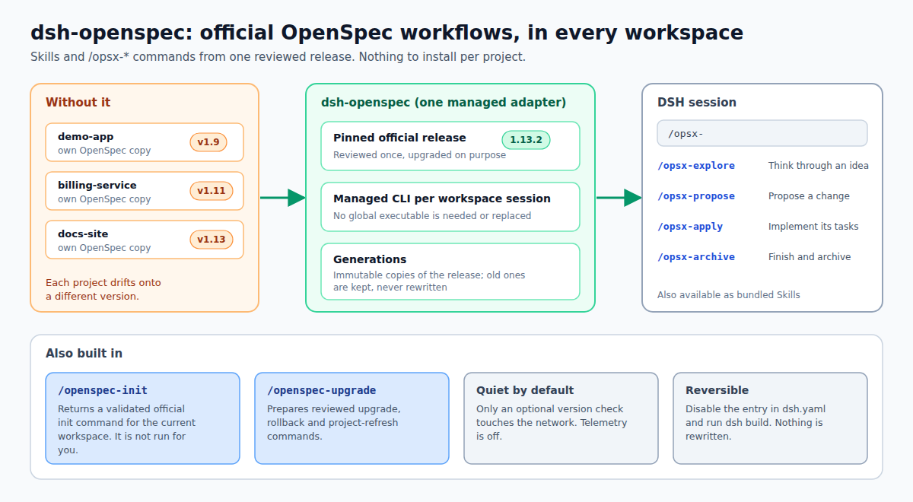

# dsh-openspec

[English](README.md) · 简体中文

<!-- problem -->
OpenSpec 为 AI Agent 提供的规范驱动工作流，通常得在每个项目里各装一份并手动保持更新，结果不同项目会停在不同的版本上。dsh-openspec 让官方工作流在每个 DSH 工作区里都以现成的 Skill 和 `/opsx-*` 命令可用，并全部固定在同一个经过审查的 OpenSpec 版本上，由你有意识地升级。



**你能得到什么**

- **完整的官方工作流目录**：以内置 Skill 和 `opsx-*` 斜杠命令的形式提供，由某一个确切的 OpenSpec 版本（当前 1.13.2，固定在 `package.json` 中）生成，而不是复制进每个项目。
- **每个工作区会话一套受管 CLI。** 每个被使用的工作流都带着一条不可变、与版本绑定的 CLI 调用串；不拦截、也不需要全局 `openspec` 可执行文件。
- **`/openspec-init`** 为当前工作区返回一条经过校验的官方 init 命令，**`/openspec-upgrade`** 则准备经过审查的升级、回滚和项目刷新命令。
- **默认安静且私密。** 唯一的网络请求是可选的、不带凭据的版本检查，受管 CLI 的遥测默认关闭，除非你主动打开。
- **可逆。** 禁用 manifest 条目并 sync 即可；旧的 generation 会被保留，绝不静默改写。

**安装。** 在 ohmydsh 里，本 package 由 `dsh.yaml` 管理（条目 `dsh-openspec`，`source: local`）：启用后运行 `dsh build`。本 README 没有记录独立安装方式。周边仓库见[插件索引](../../README.zh.md#插件索引)。

**快速跳转：**[工作方式](#工作方式) · [用法](#用法) · [配置](#配置) · [Generation 与宿主机依赖布局](#generation-与宿主机依赖布局) · [安全与隐私](#安全与隐私) · [升级与移除](#升级与移除) · [恢复](#恢复) · [已知范围缺口](#已知范围缺口) · [开发](#开发) · [归属说明](#归属说明)

## 工作方式

这是一个 DSH 宿主层适配器，把官方 OpenSpec 工作流目录以内置 Skill 和 `opsx-*` 命令的形式提供出来。每个被使用的工作流都附带一条不可变的受管 CLI 调用串；它不拦截全局的 `openspec` 可执行文件。

Skill 与命令的正文来自所固定的官方发布版自带的 renderer，其后跟着一个格式封闭的适配器块，把 CLI 和模板绑定到该版本。Skill 路径与斜杠命令路径交付的块逐字节相同。提供的内容跟随当前调用的工作区，以及官方生效的 profile 与 delivery 配置，所以在那里被去掉的工作流不会再被列出。

## 用法

通过 `dsh.yaml` 启用这个 local package，build/sync profile，然后使用官方工作流 Skill 或对应的斜杠命令。

- `/openspec-init` 为当前工作区返回一条经过校验的官方 CLI 命令；适配器自己不会去执行它。默认是非交互的 `--tools none --no-copilot-cloud --no-animation`，因此不会重复生成项目级的工具 Skill。
- `/openspec-upgrade` 是适配器自定义的入口，用于检查和升级受管的官方 OpenSpec 栈（CLI 与工作流模板），它不是官方的变更工作流，也不是系统全局安装的升级。它把软件升级/回滚、项目指令刷新（`openspec update`）和 OpenSpec 变更修订（`opsx-update`）区分开。此前的管理命令名没有注册成别名；重新加载会物化一个新的 generation，并原样保留旧的 generation 目录。

## 配置

选项是本插件自己的 Config（`dsh-openspec` 那一行）的字段，持久化在 profile patch 里。没有单独的设置注册表，也没有 `settings.yaml` 分节。

- `updateCheck`：`enabled`（默认）或 `disabled`；只在使用 Skill/命令时检查固定的、不带凭据的 npm latest 端点。`disabled` 时一个网络请求也不发。
- `telemetry`：`adapter-off`（默认）或 `official`；`adapter-off` 会给受管 CLI 设置 `OPENSPEC_TELEMETRY=0`，`official` 则交由官方 CLI 自己的设置决定。所选策略包含在受管调用串里。

这两个字段都不支持实时编辑：改动会让插件重新挂载，使受管调用串和 generation 身份由同一个一致的值重新计算。这两个字段刻意没有标记为 volatile，因此请到 profile patch 里 `dsh-openspec` 那一行的 `config` 中修改，不要期待在设置表单里看到。非法值会在插件挂载之前被 Host 拒绝。

提示只出现在实时的使用结果里。它们不会安装包、追加消息或发起新一轮对话。

## Generation 与宿主机依赖布局

generation 是所固定的官方发布版加上其已解析依赖闭包的不可变副本；每个 Skill 正文和命令块指向的都是 `$DSH_HOME/plugins/dsh-openspec/generations/<identity>/`。两条性质保证这份副本可复现：

- 闭包目录按每个依赖自身的身份（名称、版本、自身内容）及其直接依赖的身份命名，绝不使用宿主文件系统路径。因此在不同物理布局下重装相同版本（例如嵌套副本被提升到 profile 根目录），会复现逐字节相同的内容，并复用已有的 generation，而不是发生冲突。
- 身份覆盖已解析的闭包（以及遥测模式），所以真实的依赖变化会物化并激活一个新的 generation，而不是与已有的 generation 冲突。已有的 generation 会被保留，绝不改写。

如果准备 generation 或注册适配器的 Skill 与命令失败，适配器会撤销已经注册的所有内容——不会留下任何部分可见的表面——并通过宿主 logger 恰好写出一行错误：

```
dsh-openspec: startup contributions failed (<code>); no Skills or commands were registered
```

`<code>` 是 `generation-identity-collision`、`generation-invalid` 或 `dependency-closure-ambiguous` 这类错误类别，绝不是路径或上游文本。这一行表示会话里的表面是按设计缺席，而不是悄悄丢失；已记录的问题消除后，重启会重新物化它。促成这一设计的排查过程记录在 [`docs/generation-identity.md`](docs/generation-identity.md)。

## 安全与隐私

- **不在 Host 侧做变更。** 处理器只准备指引。显式请求的 init、升级、回滚或刷新，必须由 Agent 通过调用方会话的 Bash 去执行，沿用现有的沙箱、文件系统和 Worktree Session 策略。被拒绝的调用不得改走 Host 或另一个 cwd 重试。
- **参数校验。** `/openspec-init` 只接受所固定发布版的官方 tool 与 profile 取值，以及符合固定格式的 `language`；不安全或未知的参数会得到带类型的校验错误，且不提供任何命令。命令串由适配器代码构建并做 shell 引用，绝不由模型构建。
- **网络。** `updateCheck: enabled` 时，只向固定的 npm 端点请求一次 `@fission-ai/openspec` 的 latest，只读取 `version` 字段，不带任何凭据，并有缓存和退避。不会发送任何会话、代码、路径或 provider 凭据。
- **遥测。** 受管 CLI 的遥测默认关闭（`telemetry: adapter-off`），项目刷新也始终关闭官方 CLI 独立的更新检查。

## 升级与移除

**状态：进行中（WIP）。** 整体变更尚未验收；真实运行时下的升级/重载以及策略拒绝的证据仍然缺失（见[已归档变更的验证记录](../../openspec/changes/archive/2026-10-09-add-dsh-openspec-adapter/verify.md)）。评审 I1 报告的本地 Host 变更绕过已被移除：处理器只准备指引，显式请求的动作必须通过调用方会话的 Bash 执行 `lib/session-updater.js`。这一修复尚未在已部署的运行时中验证。

升级/回滚是源码所有的事务，需要通过调用方会话受控的 Bash 显式批准；它不会顺带刷新项目指令或重启 DSH。公开语法：

- `/openspec-upgrade` —— 报告适配器状态；不做任何变更。
- `/openspec-upgrade upgrade X.Y.Z --approve` / `/openspec-upgrade rollback X.Y.Z --approve` —— 准备一条精确到版本的 updater 命令。调用方必须位于记录在案的权威 checkout 中（不能是 Git worktree）；helper 会在任何暂存或源码写入之前复核这一点。没有字面量 `--approve` 就不会提供命令。
- `/openspec-upgrade refresh-project --approve` —— 准备一次单独授权的 `openspec update`，使用当前生效的受管 generation CLI 和调用方会话的 cwd，而不是 Host 的 cwd。此操作不会运行任何升级/sync 事务。

处理器既不执行这两类动作，也不报告它们已完成。Agent 必须在所述的 Bash `workdir` 中运行给出的、带引用的命令，并如实报告实际结果。`pending-reload` 不会触发自动重启。helper 的项目刷新遵循已配置的遥测模式，并始终关闭官方 CLI 独立的更新检查。

`scripts/sync.mjs` 把权威 checkout 记录在 `$DSH_HOME/plugins/dsh-openspec/source-checkout.json` 中；没有这条记录，或该 checkout 是 Git worktree 时，升级会被阻止。结果为 `activation: pending-reload` 表示新的 pin 已提交，而之前生效的 generation 会继续服务，直到下一次 DSH 启动。请保持记录在案的权威 checkout 可用。

**移除。** 禁用 manifest 条目并 sync；待所有使用该适配器的 DSH 会话结束后，可按需手动删除 `$DSH_HOME/plugins/dsh-openspec/generations/` 下已过时的非活跃目录。V1 有意不自动清除 generation。

## 恢复

如果存在已准备好的 journal，常规升级会被阻止，Host 继续使用之前的 generation。经显式批准、指向 journal 中确切的上一版本的 `/openspec-upgrade rollback X.Y.Z --approve`，会通过同一个会话 helper 执行受保护的恢复。它在暂存之后复核源码与 journal 的哈希；用户的编辑需要手动协调，而不是被覆盖。恢复不会刷新项目，也不会自动重启 DSH。

事务会同时锁定本 profile 和物理上的源码 checkout（跨 profile）。源码锁是操作系统临时目录中的 `dsh-openspec-source-<checkout realpath 的 sha256>.lock` 文件，记录了持有者 pid、checkout 与 profile 状态目录。被杀掉的进程可能留下任何一把锁。不存在基于时间或自动的锁回收：在证明记录的持有者已不存在并协调好所有 profile 之后，检查并保留 journal 与源码字节，只显式删除经核实已被遗弃的锁，然后对 journal 中确切的上一版本执行经批准的回滚。任何源码漂移都需要手动协调；切勿为了能再次升级而丢弃 journal。不要为了让升级继续而删除仍存活或持有者未知的锁。这套 operator 恢复仍是一个 WIP 的验收缺口。

## 已知范围缺口

DSH 会把宿主层的 Skill provider 合并进每个 scope，包括 Pet executor 和 Locus 子 scope。本适配器沿用现有宿主 provider 的做法，不实现按 preset 的隔离。该问题以跨 provider 的方式记录在 [`BACKLOG.md`](../../BACKLOG.md) 的 D006 中，必须在 Pet/注册表边界一次性修复。

## 开发

在仓库根目录用 `npm install` 或 `npm ci` 安装依赖，然后用 `--workspace dsh-openspec` 运行 package 命令：`build` 与 `typecheck` 使用 `tsc`，`test` 运行 `vitest`（并先构建）。生成的 `lib/` 不被跟踪。

当前行为由 [`dsh-openspec-session`](../../openspec/specs/dsh-openspec-session/spec.md)、[`dsh-openspec-updates`](../../openspec/specs/dsh-openspec-updates/spec.md) 与 [`dsh-openspec-routing-extension`](../../openspec/specs/dsh-openspec-routing-extension/spec.md) 规范定义。

## 归属说明

本 package 是 ohmydsh 的原创实现，没有复制先行作品的任何源码。承认的先行作品：`@codigoconelmer/dsh-openspec@0.1.0`，MIT 许可。OpenSpec CLI 与工作流模板由 `@fission-ai/openspec` 提供；上游许可与声明见其 package 元数据和许可证。详情见 [`NOTICE`](NOTICE)。
