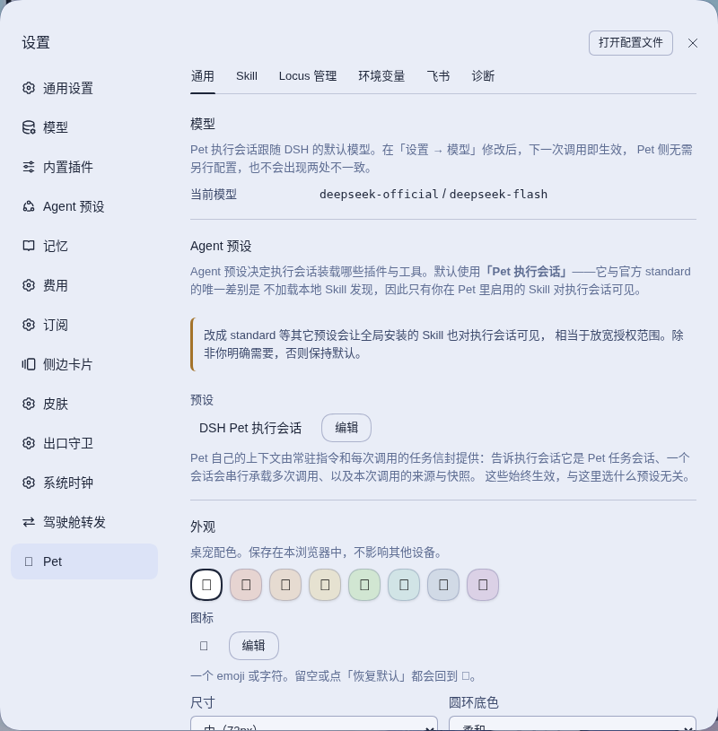

# dsh-pet

English · [简体中文](README.zh.md)

<!-- problem -->
Routine chores such as cleaning up a worktree or answering a teammate's question from chat usually mean interrupting the session you are developing in, or pasting context into a new one by hand. Pet is a small floating companion in the DSH web UI that runs those chores for you in a separate session, working from a frozen copy of what you were looking at, so your development session stays clean and every action stays traceable.



**What you get**

- **Quick actions without leaving your work.** A draggable mascot with a wheel of shortcuts. Each one runs an ordinary DSH Skill that you import yourself, in its own executor session, against an immutable snapshot of the session or workspace you were in.
- **A traceable record.** Every request is a Task, Invocation and Run you can inspect in the task panel; nothing is written into your development session.
- **Chat as an entry point (optional, off by default).** Bind a Lark bot and an allowlisted teammate can mention it in a group or message it directly; a dedicated, read-only child session answers from the context of your work.
- **A Q&A group for a session.** One click on the wheel opens a Lark group tied to the session you have been working in, so others can ask questions without touching your session.
- **Fail-closed by design.** Pet never reads provider credentials, never accepts a model-invented destination, and degrades on its own when a dependency is missing instead of breaking DSH.

**Install.** In an ohmydsh setup this package is managed through `dsh.yaml` (entry `dsh-pet`, `source: local`): set `enabled: true` and run `dsh build`. The package does not depend on ohmydsh at runtime and can also be installed on its own; see [Installation and compatibility](#installation-and-compatibility). For the surrounding repository see the [plugin index](../../README.md#plugins).

**Jump to:** [Product concepts](#product-concepts) · [Skills and environment values](#skills-and-environment-values) · [Settings](#settings) · [Lark channel and Locus](#lark-channel-and-locus) · [Trust model and guards](#trust-model-and-guards) · [Runtime state and lifecycle](#runtime-state-and-lifecycle) · [Installation and compatibility](#installation-and-compatibility) · [Development](#development)

## Product concepts
<!-- section: concepts -->

Pet ships as one package with a **Host half** (persistence, task coordination, session creation, tools) and a **Web half** (a draggable mascot, a capability menu, a task panel and a settings section).

These four are deliberately distinct entities, not synonyms:

| Concept | What it is |
| --- | --- |
| **Task** | A long-lived work thread for one source scope. Owns exactly one executor session for its whole lifetime. |
| **Invocation** | One user request inside a Task. Each has its own immutable snapshot. |
| **Snapshot** | The source state frozen at the moment you invoked a capability. Never rewritten. |
| **Run** | One execution attempt of an Invocation. A transient retry adds a Run; it never re-targets. |

**Source session vs executor session.** The *source* is the session you were looking at when you invoked Pet. The *executor* is an ordinary DSH root session in the Pet-owned `DSH Pet` workspace that actually does the work. They are never the same session, and Pet never runs inside your development session.

At most one unarchived Task exists per source scope (`session:<id>`, `workspace:<id>`, or the independent scope). Invoking three capabilities from one session appends three Invocations to one Task and one executor session — it does not create three sessions. Archiving closes a Task permanently; the next invocation from that source starts a **new epoch** with a fresh executor.

### Why snapshots are captured in the browser

The active session is browser UI state. The Host cannot observe it and cannot reconstruct it afterwards. So Pet freezes the source at the instant you confirm an Invocation. If you switch pages immediately after clicking, the running Invocation still targets the session you launched it from.

## Skills and environment values
<!-- section: skills-and-env -->

### Skill installation and isolation

Pet does **not** inherit DSH's global Skill discovery, and it ships **no Skills of its own**. Every capability comes from an ordinary DSH Skill the user imports explicitly. Two facts are stored separately per Skill: whether it is registered, and whether it is enabled (plus whether it appears as a shortcut).

Crucially, Pet reads **nothing Pet-specific** from a `SKILL.md`. There is no `petLabel`, `petIcon` or `petContext` — a Skill cannot opt into better treatment inside Pet, so "Pet-adapted" and "ordinary" Skills are the same thing. The capability's label is the Skill name and its description is the Skill's own. This is why [`skills/ws`](../../skills/ws/SKILL.md) from the ohmydsh repository works as a Pet capability with no changes whatsoever.

The single install source is **local import** from an absolute path *on the Host machine running `dsh web`* (not the browser's machine). Import is two steps: a read-only inspection showing name, description and file inventory, then a separately confirmed registration.

Every import is validated (`SKILL.md` present, kebab-case name, non-empty description, no symlinks, no special files, no path escapes, file-count/per-file/total-size limits). What is stored is a **link to the user's own directory**, not a copy:

```
skillName -> /absolute/path/the/user/gave
```

Editing that directory takes effect immediately, with no re-import. Deleting or moving it makes the Skill unresolvable, and the capability refuses to run rather than executing something stale.

The capability wheel also holds **Host built-in actions** next to Skills (today: the Q&A group action described below). A built-in action is not a Skill, never enters the Skill allowlist and produces no `/<skill-name>` envelope; its availability is computed from its own dependencies and shown disabled, with the reason, when something is missing. Built-in actions and Skills share the wheel's capacity (three rings of 6, 8 and 10, at most 24 entries).

#### Managed symlink projection

Registered, enabled Skills are projected into the Pet workspace as **Pet-created directory symlinks**:

```
$DSH_HOME/plugins/dsh-pet/workspace/.dsh/skills/<name>
  -> /absolute/path/the/user/gave
```

DSH's filesystem Skill provider follows direct child symlinks, so one canonical directory serves every runtime. Pet does **not** also copy into `.agents/skills` or provider-specific directories: Skills belong to the DSH Agent runtime, not to the selected LLM provider, and duplicate roots create ambiguous precedence.

**The projection is not the authorization boundary.** The Pet allowlist provider is, and the executor runs on a dedicated preset that leaves out the filesystem Skill provider so global Skills cannot leak in (see [ADR-0001](docs/adr/ADR-0001-executor-preset.md)). A projection entry that is missing, not a symlink, or broken is treated as drift: the affected Skill fails closed until you rebuild the projection explicitly from Settings → Diagnostics.

Pet applies **no per-capability context gate**. Any capability can be invoked from any source, including the independent scope — knowing what a given Skill requires would mean the Skill declaring it, which is exactly the coupling above removes. A Skill that needs a session, a repository or a configured value checks its own snapshot through `pet_context` and stops to ask when something is missing.

### Environment values

A Skill often needs a value Pet cannot infer — which review group to post to, which URL shape identifies this organization's merge requests. Those are configured in Settings and reach the Skill as **ordinary environment variables**, so nothing organization-specific has to be written into a Skill that is otherwise shareable.

Two scopes, resolved per Invocation from the snapshot's source workspace:

| Scope | Applies to |
| --- | --- |
| `global` | Every Pet Task, including independent ones |
| A workspace id | Only Tasks sourced from that workspace; **overrides** a same-named global entry |

Keys are upper snake case and are injected with a `DSH_PET_` prefix, so `CR_GROUP` is read as `$DSH_PET_CR_GROUP`. When neither scope defines a key the variable is simply absent — Pet invents no default, and a Skill that needs it is expected to stop and ask rather than guess.

Injection goes through DSH's own `ctx.shellEnv` registry, so values travel on the `dshEnv` channel to the child process and never appear in the prompt, the envelope or any model-visible text. The registry is an **optional** dependency: where it is absent Pet logs the fact and injects nothing instead of degrading.

Values are stored in Pet's SQLite state, not in any repository, and they reach every command the executor runs. The panel says as much: this is not a credential store, and the masking in the list is display-only.

## Settings
<!-- section: settings -->

Six stable tabs:

- **General** — appearance/position reset, provider/model, default context policy
- **Skills** — local import, enable/disable, shortcut visibility, run arguments, removal, projection status. Pet ships no Skills of its own, so this list starts empty
- **Locus** — the Lark entries associated with DSH sessions: read-only display, navigation and lifecycle actions (see [Lark channel and Locus](#lark-channel-and-locus)). It offers no control that creates an external resource
- **Environment** — key/value pairs in a `global` scope and per source workspace, injected into executor shell calls as `DSH_PET_*`
- **Channel** — Lark bot binding, the enable switch, permitted senders (including pairing) and the default workspace for automatically created main sessions
- **Diagnostics** — lifecycle, paths, allowlist, drift, explicit rebuild, channel connection state

The floating Pet and Task panel handle only quick execution, source confirmation and day-to-day Task operations. Installation, environment and diagnostics live in Settings. While no bot is bound, the floating Pet shows one dismissible hint that leads to the Channel tab; a Skill hint takes priority over it, and dismissing it never removes the Channel tab.

## Lark channel and Locus
<!-- section: lark-channel -->

Pet can take work from Lark: mention the bound bot in a group, or message it directly. It is **off by default** and needs an explicit binding first. Unified **Locus** is the only production Lark execution path: a Locus is one durable association between a Lark entry (a group, or a topic inside it), a DSH **main session** and a dedicated **child session** that serves the entry. If the Host cannot compose everything Locus needs, the channel stays unavailable with a diagnostic and every inbound event fails closed; the rest of Pet keeps working.

### Binding and admission

Binding uses a dedicated `lark-cli` profile named `dsh-pet` (create a new bot, or connect an existing one). Binding immediately verifies the profile and stores the bound app's own `open_id`; display names are presentation only and never an authorization key. The app secret lives in `lark-cli`; Pet only ever passes one *through* to that CLI on stdin when connecting an existing bot.

A message reaches the Locus controller only if it passes every gate: the sender is a real user, the bot is mentioned (a direct message is no exception), message-id deduplication, a start-up watermark against replays, and a supported message type. Anything refused is dropped with a low-cardinality diagnostic and nothing else — no reaction, no reply — so a bot sitting in an unrelated group never reveals that an agent stands behind it.

Who may ask depends on the entry:

- **Allowlisted senders** (an `open_id` allowlist) can ask anywhere and are the only ones who can issue control commands or bootstrap a new entry.
- **Other members of a group** whose Locus is already active can ask by mentioning the bot, because an allowlisted person set the group up. They cannot run control commands. A direct message is always allowlist-only.
- An entry whose tool tier is `shell` (below) accepts only allowlisted senders.

**Pairing instead of looking up an `open_id`.** Settings mints a five-minute `/pair xxxx-xxxx` bearer command. The first user to send that exact command in a direct chat is atomically added to the allowlist. Do not forward it to somebody you do not intend to authorize. The code lives only in Host memory, is single-use, and a restart/cancel/replacement expires it. Pairing temporarily reuses the one supervised event consumer but never creates a Task, Invocation or Locus. Manual `open_id` entry remains an advanced fallback.

### How a conversation is built and served

- **Nothing is created when the bot joins a group.** The whole tree is built on demand by the first qualifying mention: an automatic main session for that chat in the configured **default workspace** (different chats never share one; if the default workspace is missing, nothing is created and Settings says why), plus a dedicated child session. A topic first ensures its group's structure; group and topic children are siblings under the main session, and a topic keeps the main session it was created with.
- **The child has its own context.** It starts from its own identity and the entry it serves, not from a copy of the main session's history, and Pet refuses to create it when it cannot prove the provider does not inherit parent history. When it lacks facts such as the working root, it may ask its own main session through the host's native messaging; that answer is context, never authorization.
- **One request at a time.** Each Locus keeps a durable FIFO queue of Deliveries and hands the child exactly one current Delivery. A model turn ending does not complete a Delivery. The only way to answer is the caller-bound `pet_locus_finish` tool (`reply` with a body, or `no-reply` with a reason); `pet_locus_wait` extends the deadline (initially one hour from acceptance, never beyond 24 hours). A timeout moves on to the next message on the same child session without rebuilding it.
- **Reactions are the Host's, replies are the Agent's.** The Host maintains working → done/failed reactions on the triggering message. Business text is sent by the Agent through `pet_locus_finish`, to the exact triggering message; `@name` references to chat members in a reply are rendered into real mentions when the name resolves to exactly one member.
- **Images.** Images in the current message are fetched by the Host through the pinned official `lark-cli` into a private spool, handed to the child as typed image content and deleted before settlement; see [media-download.md](docs/media-download.md) (written in Chinese). If the pinned binary or the private directory cannot be proven, only the image part is unavailable and text Deliveries continue.
- **Pet deliberately does not flatten chat history into the prompt.** The Agent uses `lark-cli` as the bound bot to fetch richer context on demand, within the tool tier it was granted.

### Control commands

Only allowlisted senders can issue these; anyone else's command is dropped silently rather than forwarded to the child as a question. Each also has a short flag form.

| Command | Effect |
| --- | --- |
| `/bind <prefix>` (`-b`) | Attach this chat to an existing main session. The prefix is the six-character short id on the session badge (at least six characters, unique, unarchived, and not a child). No match and several matches get the *same* reply, with no count and no hint that other sessions exist. An entry with no Locus yet is bound directly, with no context-change warning; an automatic entry that is idle can be switched, with an explicit "context source changed" notice; an entry already bound explicitly refuses to be overwritten until released; a busy entry refuses. |
| `/unbind` (`-u`) | Release the entry. History of both sessions stays readable. |
| `/scope read\|write` (`-s`) | Change the file-permission tier (below). |
| `/tools safe\|shell` (`-t`) | Change the tool tier (below). |

### Permission tiers

- **Every new or replaced Locus starts `read`**, and the live file policy is re-verified before work is accepted and before each Delivery. A drift pauses the entry.
- **`write` is globally disabled in the current build** (`LOCUS_WRITE_ENABLED = false`): a request is refused at the door with the real reason, and an existing `write` record is served as `read` while the durable record keeps the owner's intent. If the switch is ever turned on, `write` maps to DSH's `danger-full-access`, meaning whole-machine, unscoped file writes shared by every member of the entry. This is an explicit security decision, see [ADR-0005](../../docs/adr/ADR-0005-locus-write-grants-full-access.md).
- **Tool tier `safe` (default) or `shell`** is independent of the file tier. `shell` additionally exposes `bash` and `skill` to the child of that one entry, never delegation tools. It is not a security isolation mode: a guard that rejects common Lark send commands only lowers the chance of accidents, and the bot's credentials are reachable by a model driven by allowlisted people. See [ADR-0008](../../docs/adr/ADR-0008-locus-shell-tier.md); its OpenSpec change `pet-locus-shell-tier` is still in progress, so treat the tier as not yet part of the current specs.

### Q&A group

Click the Q&A group action on the wheel (shown as 答疑群 in the Chinese UI) while looking at a session. Pet creates the default Q&A group for that main session, with you as the group owner, and binds it to a `read` Locus with its own child session. Clicking it again opens the same group rather than creating another one. If creation fails part-way, Pet rolls back what it created and reports anything it could not reclaim.

You then invite whoever should be able to ask. Members who mention the bot are answered by a child that works from its own context and can consult your main session, not by a fresh executor reading the code cold. The Locus tab marks the default Q&A entry; it never offers to create one.

### Lifecycle

Unbinding or archiving an entry stops serving it and keeps history; it refuses while the entry is busy. If the main session is **archived**, the entry goes out of service and says so: restoring that session brings the entry back by itself, or in the Locus tab you can replace the main session, which moves every entry under it to one newly created main session in the same workspace. A mention never silently revives an entry its owner stopped, and never silently switches an entry to a different main session. An entry the Host itself invalidated (for example a failed re-attach after a restart) is rebuilt by the next *allowlisted* mention. Associations created by an older version are not migrated; re-establish them with `/bind`, which starts at `read`.

## Trust model and guards
<!-- section: trust-model -->

Prompt text is **not** an authorization boundary. These mechanisms are:

1. **`pet_context`** — a zero-argument tool. The target is resolved from the real executing session id, so a model cannot pass an identifier to redirect at another Task, session or workspace. It fails closed for ordinary sessions, archived Tasks and ambiguous or missing current work. The Locus tools (`pet_locus_finish`, `pet_locus_wait` and the read-only lookups) are caller-bound in the same way and accept no chat, message, thread or target selector.
2. **Bounded tools** — side effects (sending a message, cleaning a worktree) run through deterministic tools and existing safety gates, never through free-text destinations the model invented.
3. **Fixed child composition.** A Locus child is created from a Pet-chosen, persisted preset (`dsh-pet-executor`), never derived from the main session's preset, and is re-attached from that record after a restart. The safe tier has no general process execution, no delegation and no way to send or recall Lark messages except `pet_locus_finish`. A project-read guard also keeps the child away from the DSH home, Pet state root and attachments.
4. **Admission is closed and silent** (see [Lark channel and Locus](#lark-channel-and-locus)); a main-session resolution failure never falls back to a different workspace or session.

Pet never reads, copies or stores provider credentials. It records only the selected provider/model **ids**; authentication stays with the DSH provider and subscription plugins. The same holds for Lark credentials, which stay in `lark-cli`. Environment values are not a credential store (see above).

The management surface is made of exact paths with a strict body allowlist, restricted to same-origin loopback requests. There is deliberately **no** generic RPC bridge: no `callDshRpc`, no arbitrary prompt, no arbitrary filesystem path outside the dedicated validated import operation, and no channel destination pass-through. Unknown request fields are rejected rather than ignored, and responses are redacted before they reach the browser.

## Runtime state and lifecycle
<!-- section: runtime-state -->

Everything mutable lives under the **active** DSH home — never in the package checkout or the generated profile, so plugin upgrades and profile rebuilds cannot destroy task data:

```
$DSH_HOME/plugins/dsh-pet/
├── state.sqlite                 durable Tasks, Invocations, snapshots, runs,
│                                Locus records, registered Skills, environment values
├── workspace/                   the registered "DSH Pet" workspace
│   ├── AGENTS.md                Pet standing instructions
│   └── .dsh/skills/<name>       managed symlink projection
├── media-spool/                 private (0700) scratch space for Lark image downloads
└── skills/
    ├── store/                   legacy; unused since Skills became links
    └── staging/                 legacy; unused since Skills became links
```

> `skills/store` and `skills/staging` date from an earlier model that copied each Skill into an immutable content-addressed revision. Skills are now registered as links to the user's own directory, so both are inert. An existing installation may still hold orphaned directories there; they are safe to delete.

Pet registers **its own** SQLite storage backend (a separate `dsh-pet-storage` row, named `pet-sqlite`) and routes **only** its own `dsh_pet` domain to it. `storage-domain.routes` is an override map, so every other DSH domain keeps the profile's default backend. Pet needs atomic multi-table commits and single-writer ownership of the database file, which the official backend does not provide; the official `storage-domain` layer still performs schema validation, versioned migration and change notification. If the backend name is already owned by an incompatible composition, Pet degrades rather than writing into a foreign medium.

> The domain is spelled `dsh_pet`, not `dsh-pet`: DSH's `UNIT_NAME_RE` must stay safe as a filename and an unescaped SQL identifier, so hyphens are rejected. The route key in `cordis.patch.yml` must match exactly.

### Offline state-version migration

A Host may degrade after an upgrade when an existing `dsh_pet` unit is stamped with an older, known-additive domain version. Normal startup deliberately never opens `state.sqlite` itself: the Pet backend already owns it exclusively. Migrate each DSH home explicitly while its Host is stopped:

```bash
dsh stop
"${DSH_HOME:-$HOME/.dsh}/profiles/web/node_modules/.bin/dsh-pet-migrate-state" --dry-run
"${DSH_HOME:-$HOME/.dsh}/profiles/web/node_modules/.bin/dsh-pet-migrate-state" --yes
dsh
```

The write requires `--yes`, creates a timestamped backup beside the database, and only restamps versions proven additive by the current package. An already current database is a successful no-op. Unknown versions, v1 legacy cleanup, a missing unit stamp, or a still-running Host fail closed. When startup detects the matching version-stamp error, the `[dsh-pet] degraded` log prints the same copy/paste procedure; it never performs the migration automatically. A companion `dsh-pet-repair-truncated-keys` command (same `--dry-run` / `--yes` pattern) rewrites Locus row keys that an older release truncated at a NUL separator; collisions it cannot recover are reported, not guessed.

### Host lifecycle

The Host runs as a service inside the existing `dsh web` process — not a separate daemon. `apply` is registration-only and all fallible initialization is contained, so a Pet failure degrades **Pet alone**:

`starting → ready | degraded → stopping`

Closing the browser does not stop a running Invocation. Stopping `dsh web` stops the Pet Host, and durable state is recovered on the next start. Work whose outcome cannot be proven is marked `recovering` or `failed` with a diagnostic — never reported as success.

## Installation and compatibility
<!-- section: installation -->

### Managed by ohmydsh (this repository)

`dsh.yaml` is the single deployment switch:

```yaml
- id: dsh-pet
  type: package
  source: local
  version: 0.1.0
  enabled: true
  hostRuntimeCompatibility:
    kind: pet-unified-locus-v1
    supportedDshVersion: 0.2.0-rc.2
```

A companion `dsh-pet-executor` entry (`type: preset`) supplies the executor preset, which equals DSH's standard preset minus the filesystem Skill provider. Run `dsh build` (or `node scripts/sync.mjs`) to materialize. Set `enabled: false` and rebuild to roll back; `$DSH_HOME/plugins/dsh-pet/` is preserved so re-enabling recovers your data.

### Independent installation

The package does not depend on ohmydsh at runtime. Install it into any DSH profile and let the bundle patch (`cordis.patch.yml`) compose the Host and Web halves.

### Supported DSH range

The peer dependencies target DSH `^0.2.0-rc.2`, and this repository pins `0.2.0-rc.2`. These are pre-stable release candidates: client slots, Host Agent services and session metadata may change between versions. The long-lived `dsh web` Host additionally runs a minimal source-level compatibility overlay for `@deepseek-ai/dsh-subagent`, which Locus child sessions rely on; it is rebuilt and reviewed on every DSH version change, see [compat/subagent](compat/subagent/README.md). Without those host capabilities the Lark channel stays unavailable, and the rest of Pet is unaffected.

### Capability availability

Organization-specific integrations (internal CLIs, chat transports, Worktree Session) may be absent. Availability is **computed**: a missing dependency disables that capability with a diagnostic instead of breaking Pet. Base Pet and independent installation always load. Cross-process pitfalls found while building these integrations are collected in [dsh-plugin-integration-pitfalls](../../docs/architecture/dsh-plugin-integration-pitfalls.md).

## Development
<!-- section: development -->

```bash
npm run build      # host (tsc) + client (tsdown)
npm run typecheck  # both programs
npm test           # vitest
```

Tests run against the real DSH storage layer and real SQLite backend, and use real filesystems for symlink projection, rather than mocking those contracts. The current behavior is specified under `openspec/specs/` (`dsh-pet`, `pet-lark-channel`, `pet-locus-collaboration`, `pet-locus-media-access`, `pet-workspace-env`, `pet-top-layer`); design decisions live in [`docs/adr/`](docs/adr/ADR-0001-executor-preset.md) of this package and in the repository-level [ADRs](../../docs/adr/ADR-0004-consolidate-locus-specs-into-pet-locus-collaboration.md).

## License

MIT
