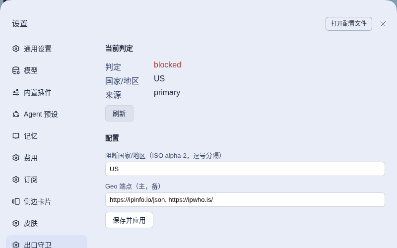

# dsh-home-network-model-guard

English · [简体中文](README.zh.md)

<!-- problem -->
Some regions are not permitted to use Claude models, and your DSH host may sit on such a network without you noticing, for example behind a home connection or VPN exit. This guard checks the country of the DSH host's egress and blocks every Claude-family request, both in the input box and at the host, whenever that country is on your blocklist or cannot be determined.



**Install.** Managed through `dsh.yaml` (entry `home-network-model-guard`, `source: local`): set `enabled: true`, run `dsh build`, then restart DSH. Setting `enabled: false` and rebuilding unloads the host gate and the web prompt, which removes the restriction entirely. Designs: the OpenSpec changes `block-claude-on-home-network`, `trusted-egress-claude-guard` and `fix-geo-timeout-budget-starvation`; the current behavior is specified in `openspec/specs/home-network-model-guard`.

## How it behaves

**The rule.** A request is blocked when the selection is a **Claude-family** model **and** the host egress verdict is anything other than `allowed`. The verdict is one of:

- `allowed`: the egress country was resolved and is **not** in the blocklist. This is a blocklist, not an allowlist: every other country is allowed.
- `blocked`: the egress country was resolved and is in the blocklist (default `CN`).
- `unknown`: no conclusion could be reached. This is treated **exactly like `blocked`** for Claude.

Non-Claude models are never affected, including while the verdict is `unknown`.

**What counts as Claude.** The provider route is `claude` or `anthropic` (or starts with `claude/` or `anthropic/`), or the model name starts with `claude` or `anthropic`. Both fields are read, because the subscriptions plugin routes Claude under its own provider id and the API-key route uses `anthropic`.

**Whose network.** The facts come from the **DSH host**, not from the browser's device, which matters when the GUI is reached over an SSH tunnel. The host resolves the egress country through two HTTPS IP-location services that back each other up. It uses the primary first and switches to the fallback on any failure (transport, timeout, non-2xx, malformed body). Only when both have failed is the verdict `unknown`. Automatic judgment never contacts Anthropic, Cloudflare or any target model's diagnostic endpoint.

**Two enforcement layers.**

- *Host (authoritative).* A listener on the `llm/stream` waterfall, registered on the root context so headless compositions are covered too, rejects every Claude-family call whose verdict is not `allowed`. It throws a stable error (`dsh-home-network-model-guard: Claude egress is restricted (<verdict>)`) and never calls `next()`, so the request never reaches the provider. This covers the CLI, subagents and any other path that bypasses the input box. Each refusal leaves one de-duplicated host log line with only the classification and degradation reason (`refused Claude egress -> <verdict> (<reason>)`); it never contains an IP, endpoint, response body or credential.
- *Web (early hint).* The web half disables the composer through the official `conversation.blocks` slot and shows the reason ("Sending is disabled: egress country is restricted"). Its own verdict starts as `unknown`, so Claude is blocked until the first answer from the host arrives. An RPC failure or error result sets it back to `unknown`. It re-queries on start, when the page becomes visible again (throttled to 10 s), and every 5 s while no successful answer has been received.

**Failover and retries.**

- Each Geo endpoint has its **own** timeout budget (`timeoutMs`, default 5 s). A slow or hanging primary can never use up the fallback's chance, so the worst case for a whole resolution is about `2 × timeoutMs`.
- Within one endpoint's budget, a transient failure (transport error or non-2xx) is retried at most once after a fixed 150 ms pause. A timeout or a deterministically bad body is not retried.
- A failed resolution is never cached. It yields `unknown`, and the next attempt is postponed with exponential backoff, 2 s doubling up to 60 s, repeating at that ceiling until the services recover. The cache can never stay degraded permanently.

**Caching.** A fresh verdict is reused while all three hold: its age is under `ttlMs` (default 5 minutes), the local network fingerprint is unchanged (the sorted set of non-internal IPv4 addresses, so a reconnect or DHCP change invalidates immediately), and the configuration generation is unchanged (the config file's modification time). A change of fingerprint or configuration generation also bypasses the backoff window. Concurrent requests share one in-flight lookup.

**Coexistence with the official block.** If the official model-selection plugin already blocks the composer (`routable === false`), the guard yields and writes nothing. It only ever clears a block it wrote itself. It watches the block slot and, if its block is cleared or overwritten while still needed, re-asserts it once, debounced. Nothing is written to the slot for a session with no loaded selection.

**Settings page.** An **Egress Guard** section (order 290) shows the current verdict, the resolved country, which service answered (primary or fallback) and any degradation reason. It also edits the blocklist and the two endpoints. This view is diagnostic only: it never changes configuration by itself and never auto-allows an observed egress.

## Configuration

The configuration lives on the host, outside the repository:

```text
$DSH_HOME/plugins/dsh-home-network-model-guard/config.json
```

(`DSH_HOME` falls back to the user's home directory when unset.) All fields are optional:

| Field | Default | Rules |
|---|---|---|
| `blockedCountries` | `["CN"]` | 1 to 64 two-letter uppercase ISO alpha-2 codes; duplicates are removed |
| `geoEndpoints` | `["https://ipinfo.io/json", "https://ipwho.is/"]` | Exactly `[primary, fallback]`; credential-free HTTPS URLs, at most 512 characters; the country is read from `country`, `countryCode` or `country_code` |
| `timeoutMs` | `5000` | Positive number; budget of **each** endpoint, not of the whole resolution |
| `ttlMs` | `300000` | Positive number; verdict cache lifetime |
| `backoffBaseMs` | `2000` | Positive number; first retry delay after a failure |
| `backoffMaxMs` | `60000` | Positive number; must be at least `backoffBaseMs` |

- Writing is validated and atomic (owner-only file mode `0600`, directory `0700`). Any field whose name looks like a credential (password, secret, token, credential, private key, API key), a non-HTTPS endpoint, or a URL with embedded userinfo is **rejected**; the guard accepts only country codes, endpoint URLs and non-secret tuning values.
- A write changes the configuration generation, which invalidates the cached verdict. The blocklist and endpoints are re-read on every resolution; `timeoutMs`, `ttlMs`, `backoffBaseMs` and `backoffMaxMs` are read when the plugin loads (the code path reads them once at mount), so changing those needs a restart.
- The settings page edits only `blockedCountries` and `geoEndpoints`; the timing fields are edited in the file.
- **A missing, unreadable or invalid file falls back to the full defaults** (blocklist `CN`) and Claude stays fail-closed.

## Boundaries & safety

- **Fail-closed, summarized.** For Claude, both a resolved blocked country and an unresolved verdict (both services down, unparseable response, change not yet confirmed, RPC unavailable, judgment error) deny sending. Non-Claude is never denied by this guard. The only ways out are a resolved `allowed` verdict, switching to a non-Claude model, or disabling the plugin in the manifest.
- **Network.** The host half is the only half that calls out, and only to the two configured Geo services (they can see the host's public IP, so they may log it). No Anthropic or Cloudflare diagnostic endpoint is contacted. The browser never performs a lookup of its own.
- **What is exposed.** The RPC channel `/dsh-home-network-model-guard` (`check`, `status`, `set-config`) is served through the Connection layer's host fence; this deployment configures no `trustedHosts`, so it is loopback-only. `check` returns the classification, freshness and a coarse degradation code (`fetch-failed`, `timeout`, `invalid-response`). `status` adds the resolved country, the answering service and the current configuration (which includes the configured endpoints) for the settings page. The raw IP is never persisted, logged or returned, and no conversation text or credentials are stored.
- **Temporary compensation in the web half.** The web half also injects `[data-input-scroll] > div{min-height:24px}` (`COMPOSER_FALLBACK_CSS` in `src/client/index.ts`). When the runtime moved the composer from a native `<textarea>` to a Lexical contenteditable (seen on 0.1.2-rc.1) it dropped the hidden mirror that gave the content area its height. With a block raised and an empty draft the content area collapsed to zero height and its overflow clipped the reason text. The rule is a one-line floor anchored on stable `data-*` attributes and applied to the content wrapper, so states that already have height are unaffected. **Remove it** once the runtime again guarantees a minimum height for the non-hero composer, and check that "blocked with an empty draft" still shows the reason. The same collapse affects the official model selection when it blocks on `routable === false`, and the floor covers that case too, unconditionally.

## Development

Run from the repository root:

```sh
npm run typecheck --workspace dsh-home-network-model-guard   # host + client projects
npm test --workspace dsh-home-network-model-guard            # judgment / cache / failover / config / gate / coexistence
npm run build --workspace dsh-home-network-model-guard       # host tsc + client tsdown
```

Restart DSH for changes to take effect. After every DSH upgrade, regression-test the `conversation.blocks` coexistence semantics and the `llm/stream` gate.
