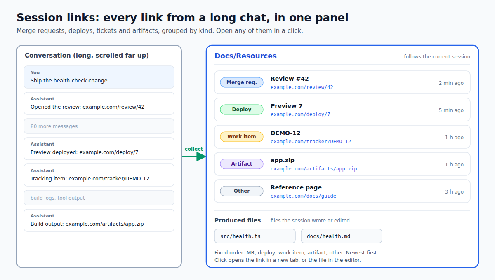

# dsh-session-links

English · [简体中文](README.zh.md)

<!-- problem -->
In a long agent conversation the merge request, deploy page, ticket or artifact link you need is buried somewhere far up the transcript, and files the agent wrote are just as hard to find. This plugin gathers them into one side panel for the current session, grouped by kind, so you can open them in a click.



**Install.** Managed through `dsh.yaml` (entry `session-links`, `source: local`): set `enabled: true`, run `dsh build`, then restart DSH. It needs the third-party `better-sidebar` plugin (`dsh-better-sidebar`, peer `>=0.16.0`, optional): without it the plugin does not activate at all. Backlog item B020; design in the OpenSpec change `session-links-panel`.

## How it behaves

The panel is a `better-sidebar` workbench tab with id `session-links`, shown in the interface as **文档/资料** ("Docs/Resources"). It is single-instance, follows the current session, and groups what it finds into:

- **Links**, in this fixed order: MR, deploy, work items, artifacts, other. Within a group the newest comes first, and at equal time links from the assistant outrank other sources. Each entry shows a readable title (host plus a path summary), a relative time and a repeat count; a click opens the URL in a new tab and injects no script.
- **Produced files** (本次产出): files the session wrote or edited successfully. Reads, deletes and failed calls do not count, and a file written then edited stays one entry. A click opens it in the sidebar editor; relative paths resolve against the session's working directory.

What is collected: user, assistant, steering and context messages. From assistant messages only the visible text blocks are scanned, never reasoning or tool-call payloads; tool results, compaction nodes and the rest are skipped. Duplicate URLs are merged, keeping the latest occurrence and a count.

How the data is built:

- **Whole-log baseline.** The host half registers a read-only `/dsh-session-links` Connection RPC channel (endpoint `links`). It reads the session's complete durable event log through `sessionPersistence`, so links hidden by "load more" or replaced by compaction still show up. The result is cached for 30 s per session.
- **Increments.** After the baseline, the browser half ingests only new messages past a monotonic `seq` watermark, scanning each session fully at most once. Re-applying a baseline never double-counts.
- **Rules.** Classification lives in one ordered table, `CATEGORY_RULES` in `src/shared/links.ts` (first match wins; unmatched URLs go to "other" and are never dropped). It matches public platforms (`gitlab`, `github`, `bitbucket`, `gitee` hosts) plus host, path and query patterns for deploy and artifact links. Extending it means editing that table and its tests.

## Configuration

Organization-specific hosts are configuration, not source. In the plugin row's `config`, usually via a private overlay patch that overrides this row:

```yaml
- id: session-links
  name: dsh-session-links
  config:
    reviewHosts: [git.corp.example]      # extra MR/PR hosts (subdomains included)
    trackerHosts: [tracker.corp.example] # hosts classed as work items (subdomains included)
```

| Key | Default | Meaning |
|---|---|---|
| `reviewHosts` | `[]` | Extra code-review hosts, in addition to the public platforms |
| `trackerHosts` | `[]` | Hosts whose links are work items; with none configured the work-item group stays empty |

Entries are lower-cased, trimmed and validated as host names, and invalid ones are dropped. The host sends these rules to the browser together with the baseline, so both halves classify the same way.

## Boundaries & safety

- Read-only and local. No external network requests, no CDN, no credentials read or written. The only traffic is the browser-to-host Connection RPC, which stays on the loopback-only Connection fence.
- Nothing is persisted. After a refresh the current session's set is rebuilt once. The panel shows what the current snapshot and log contain, not a host-side query history.
- Fails safe to an empty state when the snapshot structure changes, the host is absent or there is no current session; if the host baseline fails, the panel still shows the links visible in the live snapshot. Other tabs are unaffected.
- The collector does not modify the official session data and keeps only extracted entries, not message bodies.

## Development

Run from the repository root:

```sh
npm install
npm run typecheck --workspace dsh-session-links   # tsc host + client
npm test --workspace dsh-session-links            # vitest: links / collector / extraction
npm run build --workspace dsh-session-links       # host (tsc) + client (tsdown) -> lib/
```
