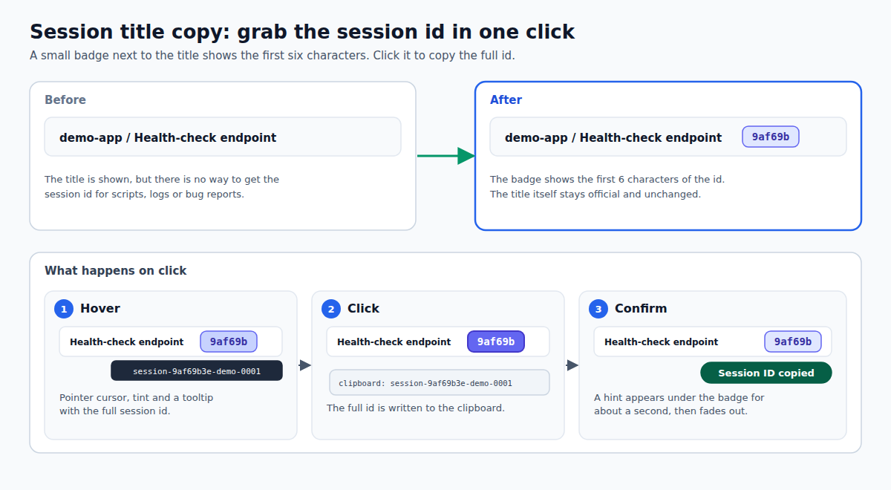

# dsh-session-title-copy

[English](README.md) · 简体中文

<!-- problem -->
DSH 会显示对话标题，却没有办法取到会话 id，而脚本、日志排查和提 bug 都要用它。这个插件在标题旁加一个 6 位的小徽标，点一下就复制完整的 session id。



**安装。** 通过 `dsh.yaml` 管理（条目 `session-title-copy`，`source: local`）：设为 `enabled: true`，运行 `dsh build`，然后重启 DSH。设计见 OpenSpec change `session-title-copy` 与 `session-title-id-badge`。

## 行为

- 当前会话标题**右侧**出现徽标（`data-dsh-session-title-copy-badge`），显示去掉 `session-` 前缀的 session id 前 6 位，例如 `session-9af69be9-…` 显示为 `9af69b`。
- 真相源是官方 sessions list 的 `current`，与 cockpit bridge 用的是同一个订阅 seam。会话切换和标题更新后，徽标文本与复制目标会跟随；没有标题（空白会话或 hero 视图）时不显示徽标。
- 点击复制**完整**的当前 session id。hover 时显示 pointer、底色和带完整 id 的 tooltip。复制成功后，徽标下方出现瞬态提示“会话 ID 已复制”，1.2 秒后以 200 毫秒淡出。
- 标题本身保持官方原样：仍是 `disabled`、cursor default、无点击行为。祖先面包屑（历史会话的标题）行为不变，仍是打开对应会话，不复制。0.1.0 曾把标题本身做成点击复制，0.1.1 起放弃：它不易被发现，而且面包屑本来是导航控件。

实现方式（DSH 升级后需回归）：

1. `title-locator.ts` 定位官方标题区里的面包屑 `nav`，这是唯一了解官方结构的文件。
2. 在 `nav` 之后插入自建的 `<button>` 徽标（自有标记、内联样式、带完整 id 的 tooltip）。
3. 点击时从 `sessions.list` 读 `current`，调用 `navigator.clipboard.writeText`，再显示提示。
4. `MutationObserver`（子树与 class 变更）加 sessions 订阅，触发经 rAF 防抖的 reconcile：徽标存在就更新文本，缺失就重建，没有标题区就清除残留。

## 配置

无。插件行没有任何 `config` 字段，没有设置、不保存数据，也不读取环境变量。要移除它，在 `dsh.yaml` 里设 `enabled: false` 并 sync。

## 边界与安全

- 不发网络请求，没有 host 侧能力（host 半区是空入口），也不读取或上传会话内容；只用到当前 session id。
- 官方 DOM 变化导致找不到插入点时，不注入也不报错；剪贴板 API 不可用或被拒绝时保持静默。
- Peer 依赖：`@deepseek-ai/cordis` 与 `@deepseek-ai/dsh-api-session-controller`（web client 半区用到后者）。

## 开发

在仓库根目录运行：

```sh
npm run typecheck --workspace dsh-session-title-copy   # host + client 双项目
npm run build --workspace dsh-session-title-copy       # tsc（host）+ tsdown（client bundle）
npm test --workspace dsh-session-title-copy            # vitest，结构桩，无浏览器
```

官方结构变化时，应当只需要修 `src/client/title-locator.ts`。
