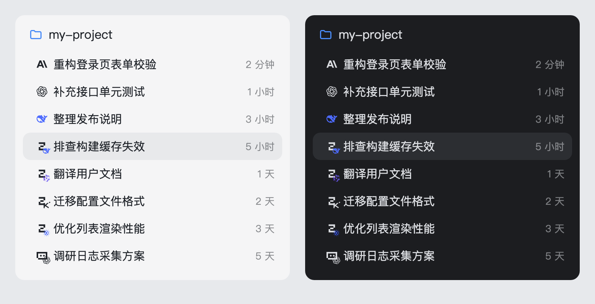

# dsh-sidebar-session-provider-icon

English · [简体中文](README.zh.md)

<!-- problem -->
In the DSH session list every row looks alike, so you cannot tell which model a conversation uses without opening it. This plugin puts the brand logo of the model currently selected in the input box in front of each session title, and updates it the moment you switch models. When the provider and the model come from different vendors (for example `opencode-go/deepseek-v4-flash`), the provider logo carries a small model logo in its bottom-right corner.




**Install.** Managed through `dsh.yaml` (entry `sidebar-session-provider-icon`, `source: local`): set `enabled: true`, run `dsh build`, then restart DSH. Current behavior is specified in [`openspec/specs/sidebar-session-provider-icon`](../../openspec/specs/sidebar-session-provider-icon/spec.md); design history lives in the archived changes [`sidebar-session-provider-icon`](../../openspec/changes/archive/2026-08-21-sidebar-session-provider-icon/) and [`sidebar-provider-icon-composite-model-badge`](../../openspec/changes/archive/2026-10-10-sidebar-provider-icon-composite-model-badge/).

## How it behaves

The logo shown for a session comes from two sources, in this order:

1. **Live selection (preferred).** The official `dsh-client-ui-model-selection` store, read as `ctx.modelDirectories.directoryFor(sessionId).store.current`. It is the single per-session state shared by the input-box selector and the `/model` command, and it publishes `{ provider, model }` as soon as `session.selectModel` succeeds. The open session, including a blank one that has not sent a message yet, therefore follows the input-box selection.
2. **Last request (cold-history fallback).** A Host `provider` session projection folds the `request/header` events of the session log, so a history session whose selector has not been loaded in this browser still shows the provider of its most recent real request. It survives restarts and uses no `localStorage`.

Brand resolution has two independent dimensions: the provider route picks the **main logo**, the model id picks the **corner logo**.

| Selection | Shown |
|---|---|
| `claude/claude-opus-5`, `codex/gpt-6-luna`, `deepseek-official/deepseek-v4-pro` (same vendor) | a single Anthropic / OpenAI / DeepSeek logo |
| `opencode-go/deepseek-v4-flash`, `opencode-go/qwen3.8-flash`, `opencode-go/kimi-k2.7-code` | OpenCode, with DeepSeek / Qwen / Kimi in the corner |
| `traex/GPT-5.6-Sol[1m]`, `traex/DeepSeek-V4-Flash`, `traex/Gemini-3.1-Pro-Preview` | Trae, with OpenAI / DeepSeek / Gemini in the corner |
| `traex/openrouter-3o[1m]`, `traex/Seed-2.1-Pro-0915` | Trae, with OpenRouter / ByteDance in the corner |
| known route + unrecognized model (e.g. `opencode-go/omen-alpha`) | the route logo only, no corner logo |
| unknown or generic route | a single logo from the model name; if that also fails, a neutral single-letter badge |

- **Route first.** `opencode-go/deepseek-v4-flash` shows OpenCode as the main logo; DeepSeek can only appear in the corner.
- **No impersonation.** A model whose vendor cannot be identified gets no corner logo, and never a letter badge in the corner.
- **Size.** The composite keeps the 14×14 footprint of a single logo, so the row layout does not move. The corner logo is the bare 10px glyph, overhanging the bottom-right by 4px, with no plate, ring or padding: at this scale any decoration eats the pixels the glyph needs.
- **Tooltip.** Hovering always shows the exact `provider · model`.

| Layer | Implementation |
|---|---|
| Host | `src/provider.ts` registers the `provider` projection (it requires the `sessionProjections` service) and folds `request/header`; it only serves the cold-history fallback |
| Client data | Subscribes to the per-session stores of `ctx.modelDirectories`; the selector choice wins over the projection fallback |
| Client DOM | `row-locator.ts` holds all knowledge of the official row DOM; a `MutationObserver` maintains a separate badge `<span>` in front of the title |
| Brand art | `src/client/assets/*.svg`, downloaded once and bundled; `logos.ts` resolves the provider brand and the model brand separately and renders the composite when they differ |

The badge content is derived only from `(provider, model)`; `index.ts` rebuilds a badge only when those values or the tooltip change.

## Configuration

None. The plugin row carries no `config` fields and the package reads no environment variables.

Recognized brands:

| Dimension | Brands |
|---|---|
| provider and model | DeepSeek, OpenAI/GPT/Codex, Anthropic/Claude, Grok/xAI, Kimi/Moonshot, GLM (Zhipu), MiniMax, Pi, OpenClaw, Hermes Agent (the misspelling `hermas` is also accepted), OpenCode, Qwen, Tencent Hunyuan (`hy3`, `hy4-*`), Meituan LongCat, Xiaomi MiMo, Gemini/Gemma, NVIDIA (Nemotron), Meta (Muse Spark, Llama), Ant Group (Ling/Ring), OpenRouter, ByteDance Seed |
| provider only | Trae (`trae`, `trae-ai`, `traex*`; exact name or prefix, never a substring) |

The model dimension covers every identifiable model family in the OpenCode Go / Zen catalogs, plus the GPT, DeepSeek, Gemini, OpenRouter and ByteDance Seed families in the current TraeX catalog.

Brand art is pinned and vendored, never hand-drawn and never fetched from a CDN at runtime:

- every brand except OpenCode: `@lobehub/icons-static-svg@1.94.0`, MIT; the color variant is used where one exists;
- OpenCode: the official provider SVG from `anomalyco/opencode` at commit `5e75e5e9901f0d178f425bfb47f1bd46cbe78a59`, MIT.

Per-file source URLs and SHA-256 checksums are listed in [`src/client/assets/README.md`](src/client/assets/README.md). Some color SVGs carry gradient/clip ids; the corner instance suffixes them with `-sub` so copies on the same page never resolve each other's definitions.

To add a brand: put the SVG in `src/client/assets/`, record source, pin, license and SHA-256 in the assets README, then add rules and tests to `providerBrandOf` / `modelBrandOf` in `logos.ts`.

## Boundaries & safety

- The official `StateDot` is never replaced, moved or hidden; times, row menus and drag behavior stay official.
- The badge is a standalone `<span>` in front of the title. If the row DOM cannot be located reliably, the plugin silently shows nothing and leaves the page intact.
- No network requests of its own: the logos ship with the bundle and the data comes from DSH's own stores and session log.
- Code is MIT-licensed ([LICENSE](LICENSE)). Brand owners retain their trademark rights; the marks only identify the selected provider route and model and imply no endorsement.

## Development

Dependencies are installed once from the repository root; `lib/` is a gitignored build artifact. Run from the repository root:

```sh
npm install
npm run typecheck --workspace dsh-sidebar-session-provider-icon
npm test --workspace dsh-sidebar-session-provider-icon
npm run build --workspace dsh-sidebar-session-provider-icon
```

`dsh build` / sync also builds `lib/` on demand before installing this local package; refresh the Web page to pick up a new client bundle.

Under vitest, small SVGs are inlined as data URLs with attribute quotes rewritten to `'`. Any regex that rewrites SVG attributes must accept both `"` and `'`.
