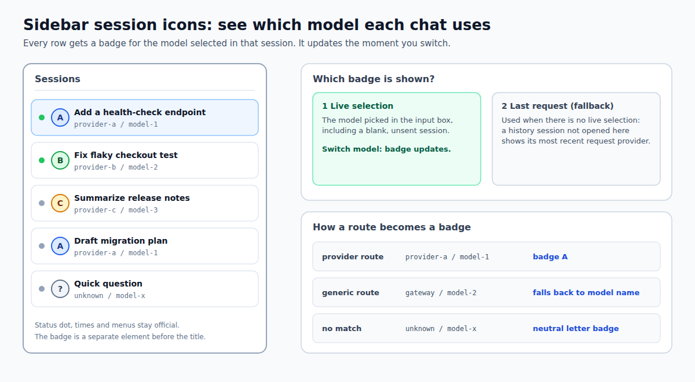

# dsh-sidebar-session-provider-icon

English · [简体中文](README.zh.md)

<!-- problem -->
In the DSH session list every row looks alike, so you cannot tell which model a conversation uses without opening it. This plugin puts the brand logo of the model currently selected in the input box in front of each session title, and updates it the moment you switch models.



**Install.** Managed through `dsh.yaml` (entry `sidebar-session-provider-icon`, `source: local`): set `enabled: true`, run `dsh build`, then restart DSH. The design is in the OpenSpec change `sidebar-session-provider-icon`.

## How it behaves

The logo shown for a session comes from two sources, in this order:

1. **Live selection (preferred).** The official `dsh-client-ui-model-selection` store, read as `ctx.modelDirectories.directoryFor(sessionId).store.current`. It is the single per-session state shared by the input-box selector and the `/model` command, and it publishes `{ provider, model }` as soon as `session.selectModel` succeeds. The open session, including a blank one that has not sent a message yet, therefore follows the input-box selection.
2. **Last request (cold-history fallback).** A Host `provider` session projection folds the `request/header` events of the session log, so a history session whose selector has not been loaded in this browser still shows the provider of its most recent real request. It survives restarts and uses no `localStorage`.

Brand resolution looks at the provider route first and only then at the model: for example a real selection of `opencode-go/deepseek-v4-flash` shows OpenCode, not DeepSeek. Only unknown or generic routes fall back to the model name, and a selection that matches nothing shows a neutral single-letter badge.

| Layer | Implementation |
|---|---|
| Host | `src/provider.ts` registers the `provider` projection (it requires the `sessionProjections` service) and folds `request/header`; it only serves the cold-history fallback |
| Client data | Subscribes to the per-session stores of `ctx.modelDirectories`; the selector choice wins over the projection fallback |
| Client DOM | `row-locator.ts` holds all knowledge of the official row DOM; a `MutationObserver` maintains a separate badge `<span>` in front of the title |
| Brand art | `src/client/assets/*.svg`, downloaded once and bundled; `logos.ts` matches known provider routes first, then the model |

## Configuration

None. The plugin row carries no `config` fields and the package reads no environment variables.

Brand art is pinned and vendored, never hand-drawn and never fetched from a CDN at runtime:

- DeepSeek, OpenAI/GPT, Anthropic, Grok, Kimi, GLM (Zhipu), MiniMax, Pi, OpenClaw and Hermes Agent (the misspelling `hermas` is also accepted): `@lobehub/icons-static-svg@1.94.0`, MIT.
- OpenCode: the official provider SVG from `anomalyco/opencode` at commit `5e75e5e9901f0d178f425bfb47f1bd46cbe78a59`, MIT.

Per-file source URLs and SHA-256 checksums are listed in [`src/client/assets/README.md`](src/client/assets/README.md).

## Boundaries & safety

- The official `StateDot` is never replaced, moved or hidden; times, row menus and drag behavior stay official.
- The badge is a standalone `<span>` in front of the title. If the row DOM cannot be located reliably, the plugin silently shows nothing and leaves the page intact.
- No network requests of its own: the logos ship with the bundle and the data comes from DSH's own stores and session log.
- Code is MIT-licensed ([LICENSE](LICENSE)). Brand owners retain their trademark rights; the marks only identify the selected provider route and imply no endorsement.

## Development

Dependencies are installed once from the repository root; `lib/` is a gitignored build artifact. Run from the repository root:

```sh
npm install
npm run typecheck --workspace dsh-sidebar-session-provider-icon
npm test --workspace dsh-sidebar-session-provider-icon
npm run build --workspace dsh-sidebar-session-provider-icon
```

`dsh build` / sync also builds `lib/` on demand before installing this local package.
