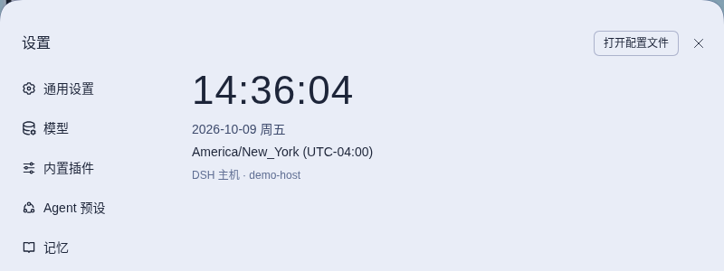

# dsh-system-clock

[English](README.md) · 简体中文

<!-- problem -->
通过 SSH 隧道从另一台机器或另一个时区访问 DSH 时，浏览器上的时间和 DSH 实际运行的那台机器并不一致。这个插件在设置面板最底部加一个 DSH 主机的实时 24 小时制时钟，按主机自己的时区显示，并带上主机名。



**安装。** 通过 `dsh.yaml` 管理（条目 `system-clock`，`source: local`）：设为 `enabled: true`，运行 `dsh build`，然后重启 DSH。Backlog 条目 B019；设计见 OpenSpec change `settings-system-clock` 与 `dsh-0-1-2-host-api-migration`。

## 行为

- 设置面板导航的最后一项**系统时钟**：粗体 `HH:MM:SS`（24 小时制、零填充、无 AM/PM）、日期行 `YYYY-MM-DD` 加随界面语言的星期、时区行（如 `Asia/Shanghai (UTC+08:00)`），以及小字 `DSH 主机 · <hostname>`。
- 时间以 host 进程为准。客户端通过 `/dsh-system-clock` Connection RPC 通道采样一次，之后按测得的 skew 在本地每秒走一次，用 `Intl.DateTimeFormat(..., { timeZone: <主机时区>, hour12: false })` 渲染。夏令时切换天然正确，客户端无需了解任何时区规则。
- 每 60 秒以及页面重新可见时重采样，用来校正漂移和主机的 DST 切换。某次重采样失败时保留旧值，时钟继续走。
- 如果从未采样成功，章节显示“主机时钟不可用”，并按同一个 60 秒周期重试。它**绝不**回退到浏览器本地时间——浏览器与主机不是同一台机器时，那会造成误导。

接线方式（DSH 升级后需回归）：host 入口 `src/index.ts` 在 `ctx.inject(['connection'])` 内注册 `connection.rpc.handle('/dsh-system-clock', …)`，与 `dsh-plugin-subscriptions` 为 `/subscriptions-auth` 使用的通道接线相同；没有 `connection` 服务（headless）时什么都不注册，插件照常加载。客户端 `src/client/index.ts` 注册官方 `settings.section`（id `system-clock`、order 300，即导航末尾）；`clock-engine.ts` 是纯 skew 引擎，`section.tsx` 是 React 接线，`clock-locales.ts` 是中英文词典。

## 配置

无。插件行没有任何 `config` 字段，也没有环境变量。章节文案跟随界面语言（zh/en）。要移除它，在 `dsh.yaml` 里设 `enabled: false` 并 sync；不持久化任何数据。

## 边界与安全

- 只读：唯一的 `now` 端点只返回主机的 epoch、IANA 时区、UTC 偏移和 hostname。不写入任何内容，也不触碰凭据、会话或文件。
- 不发起外部网络请求；唯一的流量是浏览器到 host 的 RPC。该通道仍处于仅限 loopback 的 Connection 围栏之内。
- 不修改官方 DOM 或 class 名。
- Peer 依赖：`@deepseek-ai/cordis`、`@deepseek-ai/dsh-client-connection`、`@deepseek-ai/dsh-client-locale`、`@deepseek-ai/dsh-client-ui-settings`、`react`（client 半区另需 renderer 包）。

## 开发

在仓库根目录运行：

```sh
npm run typecheck --workspace dsh-system-clock   # host + client 双项目
npm run build --workspace dsh-system-clock       # tsc（host）+ tsdown（client bundle）
npm test --workspace dsh-system-clock            # vitest：formatter / engine / host-time / wiring，无浏览器
```

构建形态与 `dsh-session-title-copy` 一致：tsdown 产出单文件 client bundle，`tsc` 产出 host 的 ESM。
