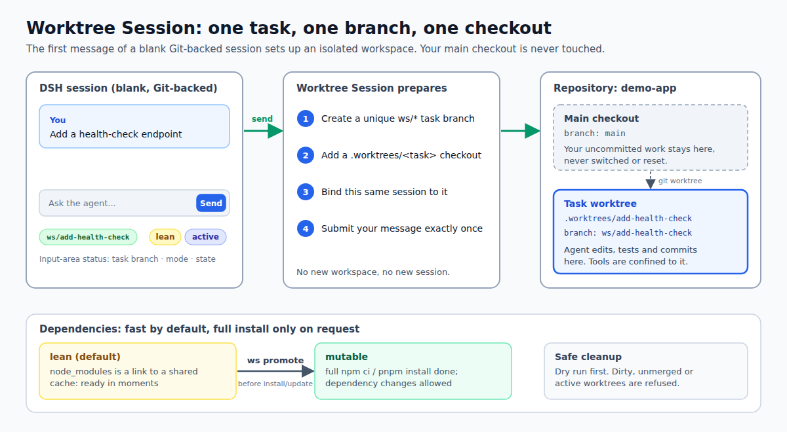

# dsh-worktree-session

English · [简体中文](README.zh.md)

<!-- problem -->
When an AI agent works on a repository it edits your checkout directly, so your own uncommitted work gets mixed with the agent's changes and two tasks cannot run side by side. Worktree Session gives every task its own Git branch and working directory, created automatically when you send the first message of a new session, so the agent stays isolated and your main checkout is never touched.



**What you get**

- **Isolation by default.** The first message of a blank, Git-backed session creates a unique `ws/*` task branch and a `.worktrees/<task>` checkout; the main checkout is never switched, reset or used as the task root.
- **Same session, no handoff.** The session stays in its original DSH Workspace; no new Workspace or Session is created, and the first message is submitted exactly once.
- **Fast dependency setup.** npm projects get a `node_modules` link into a shared cache and pnpm projects reuse the pnpm global store; a full install happens only when the agent really has to change dependencies (`promote`).
- **Guarded execution.** File tools, searches and Bash are confined to the worktree, so a bound session cannot quietly wander back into the main checkout.
- **Safe cleanup.** Preview with a dry run first; cleanup refuses dirty, unmerged, active or in-flight worktrees and never deletes remote branches.

**Install.** In an ohmydsh setup this package is managed through `dsh.yaml` (entry `worktree-session`, `source: local`): set `enabled: true` and run `dsh build`. This README documents no standalone installation. For the surrounding repository see the [plugin index](../../README.md#plugins).

**Jump to:** [How it works](#how-it-works) · [Dependency modes and promote](#dependency-modes-and-promote) · [Status and editor integration](#status-and-editor-integration) · [Configuration](#configuration) · [Safety guards](#safety-guards) · [Maintenance and cleanup](#maintenance-and-cleanup) · [Recovery](#recovery-and-persisted-binding) · [Runtime assumptions](#dsh-runtime-assumptions-and-upgrade-review) · [Development](#development) · [Attribution](#attribution)

## How it works

Worktree Session (WS) keeps **one Git repository in one DSH Workspace**. On the first submit from a blank Git-backed source Session, the opt-in flow creates a unique `ws/*` task branch and a nested `.worktrees/<task>` checkout, then binds the existing source Session to that checkout and submits the first message once through the source Session's ordinary submit path.

The flow creates **no target Workspace and no target Session**. The source Session stays in its source Workspace, and its immutable DSH cwd remains the repository root. WS separately treats `<repo>/.worktrees/<task>` as the logical **managed execution root** for local files, searches, commands, and inherited Agent execution. The main checkout is never switched, reset, or used as the managed task root.

Preparation and handoff are recoverable and fail closed. If preparation or binding fails, the source draft and all official generic attachments remain intact and are not submitted from the repository checkout. After preparation and binding, WS invokes the official SessionInput submit exactly once; DSH owns attempts, uploads, receipts, retries, echo retirement, and draft restoration.

Project type is resolved from the repository-root lockfile before any branch, worktree, operation file, or binding is created. A single `package-lock.json` or `pnpm-lock.yaml` selects npm or pnpm respectively. If both lockfiles are present, WS first honors a supported `packageManager` declaration in `package.json`, then adopts the lockfile that is tracked by Git when exactly one is tracked; the selected manager and ignored lockfile are recorded in operation diagnostics. If no unique signal proves the repository intent, WS refuses the request rather than guessing a default manager. A repository with neither lockfile is refused with an `UNSUPPORTED_PROJECT` diagnostic before any resource is created.

In the blank-session UI the base ref chooser shows each ref on a single line (truncated with an ellipsis, full name on hover). Choosing a ref only stages the selection and has no Git side effects.

## Dependency modes and promote

New Worktree Sessions are **lean by default**:

- `lean` for npm: `node_modules` is a verified link to a cache addressed by `package-lock.json`, Node major, and npm major. `lean` for pnpm installs from `pnpm-lock.yaml` inside the bound worktree and reuses pnpm's global store; workspace-internal links therefore continue to point at that worktree's own sources. Before any install, removal, update, or other dependency mutation, the Agent must run `ws promote` for the current bound Session.
- `mutable`: the package-manager-specific full install has succeeded (`npm ci` for npm, or `pnpm install --frozen-lockfile` for pnpm) and operation metadata has been updated. Only then may the Agent perform dependency mutations.

Promotion is Agent-driven and preserves the Session binding. It updates metadata and UI status, but does not change the stable model runtime context.

## Status and editor integration

The input-area status UI persistently shows the bound task branch, dependency mode (`lean` or `mutable`), and lifecycle (`active` or `cleaned`). Dynamic status is not repeatedly injected into conversation context.

Clicking the bound task branch asks an editor to open that Session's managed worktree directory. With no adapter registered, the default remains the local `vscode://file/<path>` deep link. The client exposes a runtime registration point for deployment-specific replacements; a missing, unloaded, or throwing adapter safely falls back to the local default. The Worktree Session package names no adapter and declares none in `inject`. Cleaned or unbound sessions do not offer the open action, and the target path always comes from the persistent binding.

## Configuration

- **Manifest entry.** The package is enabled through its `worktree-session` entry in `dsh.yaml`; `enabled: false` disables it without removing it.
- **`continuableDelegationTools`** (plugin Config, set in `cordis.patch.yml`; code default `[]`, shipped value `[subagent]`). Names the delegation tools whose background mode is audited as continuable, so a child Agent can inherit the managed execution root before its first step. Every other delegation tool is denied for a bound Session (see [Safety guards](#safety-guards)).
- **Editor open behavior.** Default `vscode://file/<path>`; another plugin can replace it at runtime through the client registration point described above.
- **Managed `.env.local` block.** The source `.env.local` is copied into the worktree only if Git ignores it (otherwise preparation is refused). WS then writes a managed block that points `DSH_HOME` at an isolated directory under `<git-common-dir>/ws/dsh-home/<operationId>`. The block affects `bin/dsh build` executed inside the worktree only; it does not change the process home of an already-running GUI Host.

## Safety guards

A bound Session fails closed outside its worktree:

- **File tools, searches and Bash.** Paths and `workdir` must be absolute and lexically inside the managed worktree, and are then re-checked against the canonical physical path (symlinked ancestors and not-yet-existing outputs included). Bash without an explicit worktree `workdir` is denied.
- **Delegation.** Only the audited, continuable background `subagent` configured above is allowed; a foreground (`run_in_background: false`) call is denied. One-shot providers such as `subagent_fork` and `subagent_codex`, and unknown delegation-style tools, are denied because inheritance of the managed root before the child's first step cannot be proven. `send_message` is unaffected.
- **Unaudited tools.** A tool outside the audited inventory is left alone unless its arguments expose a path, cwd, command or similar local capability, in which case it is denied until reviewed.
- **Cleaned bindings.** After cleanup, every tool is denied for the old execution root.
- **Stable context.** The model-visible context contains only durable invariants: repository root, managed worktree root, task branch, main-checkout prohibition, explicit-path rule, and promote-before-dependency-mutation guidance. Branch status, dirty state, timestamps, lifecycle phase, diagnostics, and lean/mutable mode belong in metadata/UI or on-demand status output.

## Maintenance and cleanup

The model-visible `ws` tool (`status`, `promote`, `clean`) resolves schema-v2 maintenance from the exact calling `ToolExecution.agent.session`. `ws clean` runs from an ordinary main-checkout Session (cwd equal to the repository main checkout, no Worktree Session binding of its own) and scans only that repository's Worktree Session operations; a bound Session is told to switch to the main checkout instead. The caller can also request the single-operation `specified` scope, which never touches other candidates.

An Agent may pass an explicit absolute `path` to target another worktree or repository, but every mutating use needs a one-shot user confirmation naming the action and the exact path. A read-only preview (`clean` with `dry_run`) is not gated. Silence, free text, a missing question provider or an aborted question all mean refusal.

Repository cleanup processes only safe candidates. A candidate must pass the active, dirty, in-flight, call-path and binding-integrity gates, and its task branch must be proven merged either by Git ancestry or by full patch-id equivalence (the case after a rebase); the clean result states which proof was used. Archived source Sessions are cleaned directly; an unarchived but otherwise safe candidate is offered archive-then-clean after one-shot confirmation (never during a dry run). Refusals are reported per candidate.

The `dsh-ws` CLI and Skill shell wrapper do not receive a trustworthy Session-id environment, so their interface remains explicitly path-oriented:

```text
status /absolute/worktree/path
promote /absolute/worktree/path
clean [--dry-run] /absolute/worktree/path
```

Explicit paths remain available for operator recovery and diagnostics of schema-v2 operations. Always dry-run cleanup first. Clean refuses a current, dirty, in-flight, active-bound, or merge-unproven worktree and never deletes remote branches or shared npm caches.

Successful cleanup removes only safety-proven worktree/branch runtime resources and retains a compact `cleaned` tombstone. The historical Session is not deleted or moved: it remains under the source Workspace. Until it completes an archive → unarchive transition, reopening it shows that the old execution root has been cleaned and denies reuse of that removed path.

After a cleaned Session is archived and then unarchived, WS automatically marks its source binding as terminal `released` audit history and restores the Session as an ordinary source-Workspace Session. This removes the cleaned tool guard, runtime context, status badge, and stale client stage without creating a branch, worktree, Workspace, Session, or operation. Released state is monotonic and is not recovered as a current binding after restart. The restored non-blank Session still cannot start Worktree mode: there is no `ws start`, binding reuse, or mid-Session Worktree control; Worktree startup remains blank-Session-only. A binding whose managed worktree no longer exists is released automatically in the same way.

## Recovery and persisted binding

Operation records live at `<git-common-dir>/ws/operations/<operationId>.json`. They persist the source Session binding, canonical repository, managed worktree, task branch, and dependency metadata. Host restart or Session resume revalidates the same binding before local execution continues. Repeated first-submit retries reuse the operation id and prepared resources.

For an orphaned operation, inspect it with `dsh-ws status <worktree>` and preserve or commit useful work. Destructive cleanup requires a valid schema-v2 source-session binding; an unbound or malformed schema-v2 record fails closed and requires explicit operator repair. Never force cleanup past a safety refusal.

### Schema v2 only

Only `schemaVersion: 2` source-session bindings are supported. The legacy schema-v1 target-handoff flow has been retired. A schema-v1 operation or any unknown future version is rejected at read time with an explicit unsupported-version diagnostic and fails closed: no worktree, branch, binding, dependency, or operation file is created, modified, or removed, and no binding is ever migrated or fabricated.

Historical Session logs and pre-existing Workspace/Session registrations remain independent and untouched. Cleaning safe Git resources never implies deleting or reparenting the historical DSH Workspace/Session registry or history.

## DSH runtime assumptions and upgrade review

This integration targets the exact DSH composition pinned by this repository (`dshVersion` in the root `dsh.yaml`; the package peers are declared as `^0.2.0-rc.2`), not a generic or forward-compatible abstraction. It assumes the tested contracts for model-visible local-path tools, Bash `workdir`, file/search path arguments, child Agent creation/inheritance, Agent-scoped pre-execution guards, Session lifecycle hooks, and deterministic runtime-context projection/deduplication. The audited tool inventory is the `TOOL_CONTRACTS` table in `src/host/guard.ts`; a schema or name change is meant to fail its inventory tests before release.

Binding recovery and delegated-child inheritance both hook the Agent publication boundary, `agent/created`, which fires for fresh creations and cold resumes before the first driver step. A child whose parent binding cannot be proven vetoes its own creation instead of starting in the source checkout. Agents that are already live when the plugin hot-loads are rescued explicitly. This plugin does not own top-level source Agent creation; a future DSH API that composes top-level `create/resume({ setup })` should replace this compatibility seam when exposed.

**Every DSH upgrade requires a fresh regression audit** of the installed tool inventory and argument schemas (the tool contract), child-context propagation, Agent/Session lifecycle seams, and runtime-context projection/deduplication. Unknown or drifted local-capability contracts must be treated as unsupported until reviewed and covered by tests; do not assume a newer DSH preserves the audited behavior.

## Development

Install dependencies once from the repository root with `npm install` or `npm ci`. Run package commands with `--workspace dsh-worktree-session`. The exported `lib/` and `dsh-ws` CLI are generated, gitignored artifacts; root sync builds them before installing this local package.

Current behavior is specified in [`source-workspace-worktree-session`](../../openspec/specs/source-workspace-worktree-session/spec.md). Release notes live in [`CHANGELOG.md`](CHANGELOG.md).

## Attribution

Implementation and interaction concepts were adapted from the MIT project [`LaoYueHanNi/dsh-git-worktree`](https://github.com/LaoYueHanNi/dsh-git-worktree). See [`NOTICE`](NOTICE) for the reviewed commit, license grant, and exact adaptation scope. This package has no runtime dependency on that project.

## Deferred backlog

Not implemented in the MVP: `/ws setup`, repository-local config/trust, general pnpm/Rush adapters, an explicit network ref refresh, and provider-backed squash-merge proof. These are intentionally not exposed as commands.
