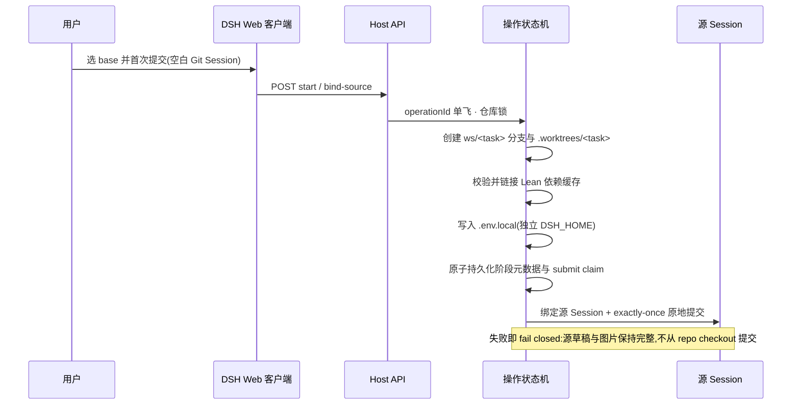
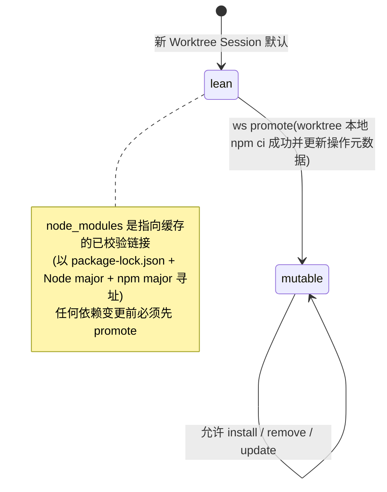
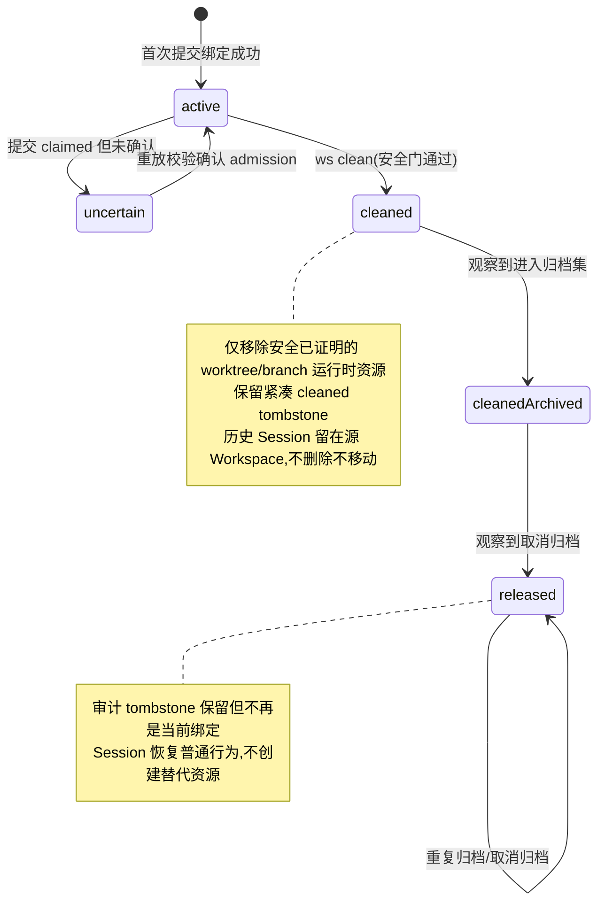

# Worktree Session 架构与交互

本文是 Worktree Session(WS)架构的可维护真相源,取代此前生成的
`worktree-session-architecture.html`(及其已过时的 schema-v1 JSON 图源)。
仅支持 **schema v2 source-session 绑定**:一 Git repo 一 DSH Workspace,
首次提交沿源 Session 原地进行,不创建目标 Workspace/Session。
详细契约见 `packages/worktree-session/README.md` 与 `skills/ws/SKILL.md`。

## 组件与信任边界

三条主链路(原交互图的三个视图):

| 视图 | 路径 | 说明 |
| --- | --- | --- |
| 源 Session 原地提交 | 用户 → Web 客户端 → Host API → 操作状态机 → 源 Session | 空白 Git Session 准备 worktree、原地绑定并沿同一源 Session 提交;不创建目标 Workspace/Session。 |
| 隔离资源准备 | 操作状态机 → Git worktree / Lean 缓存 / 隔离环境 / 操作元数据 | 仓库锁内依次创建、校验并持久化可恢复资源;逻辑执行根是 `.worktrees/<task>`。 |
| 状态与维护 | /ws Skill 与状态 UI → Host API → 操作状态机 → worktree / 缓存 | 状态 UI 与 status/promote/clean 复用 Host 安全边界;默认 lean,promote 后刷新状态。 |

### 客户端交互

- 控件只在空白 Git Session 出现;未开启时沿用普通 submit。
- 创建态 base ref 选择器(按钮标签与下拉候选项)同样单行省略,
  hover 显示完整 ref 名并保留"选择无 Git 副作用"提示;选择只更新暂存状态。
- 源 Session 原地绑定并提交,不创建目标 Workspace/Session;
  文本和图片在绑定提交被接受前保持源草稿完整。
- 输入区状态 UI 持续显示绑定任务分支、依赖模式(`lean`/`mutable`)与
  生命周期(`active`/`uncertain`/`cleaned`);分支名单行省略,hover 显示完整名。
- 点击绑定分支名用本机编辑器打开绑定 worktree
  (默认 `vscode://file/<path>` deep link,打开动作可配置);
  cleaned 或未绑定的 Session 不提供打开动作,目标路径始终来自持久化绑定。

### 安全约束

- Git 一律以 argv 方式执行,从不切换、重置或复用主 checkout 作为任务根。
- Host API same-origin、no-store,严格请求校验与错误信封。
- 依赖缓存带指纹、摘要与只读保护。
- clean 拒绝当前使用中、脏、in-flight、active 绑定或未证明合并的 worktree。

## 首次提交与可恢复操作

- 操作记录持久化在 `<git-common-dir>/ws/operations/<operationId>.json`,
  保存源 Session 绑定、规范仓库、managed worktree、任务分支、admission 状态与依赖元数据。
- 重复的首次提交重试复用同一 operationId 与已准备资源;
  `prepared` 阶段重放会重新校验并修复资源。
- 已声明(claimed)但未确认的提交进入 `uncertain`,不会被自动再次提交。
- Host 重启或 Session resume 会在继续本地执行前重新校验同一绑定。

## 依赖模式(lean / mutable)与 promote

- promote 由 Agent 驱动,保持 Session 绑定不变;
  只更新元数据与 UI 状态,不改变稳定模型运行时上下文。
- 稳定上下文只含持久不变式(仓库根、managed 根、任务分支、主 checkout 禁令、
  显式路径规则、依赖变更前 promote);动态状态走元数据/UI 或按需 status。

## 生命周期与清理

清理(模型 `ws clean` 默认面向调用仓库的主 checkout;`dsh-ws` CLI 面向显式路径,
供操作员恢复与诊断,先 `--dry-run`):

- 模型侧默认入口是普通主仓 Session:它扫描本仓库的 Worktree Session,逐项清理
  「源 Session 已归档 + 通过全部既有安全门」的候选;仍绑定 worktree 的 Session
  既不能清理自己也不能清扫同伴,会被拒绝并提示切换到主仓 Session。
- 模型调用显式提供绝对 `path` 时，Host 先通过平台用户提问能力(`ctx.userQuestions`)
  向用户展示精确 action 与路径,并给出可点选的同意/拒绝项;仅用户明确选中同意项才
  将该路径作为目标来源。该通道对调用方类型无感知,且不改变默认 cwd/binding 解析:
  省略或传空 `path` 时不询问用户、仍走默认入口。拒绝、未作答、仅自由文本、无 provider
  与询问抛错全部 fail closed;同意不记忆也不跨调用复用。
  ⚠ 刻意不使用 approval(沙箱提权授权):`danger-full-access` preset 绑定
  `approval: never`,请求会在触达用户前被自动拒绝 —— 人类决定不属于提权通道。
  代价是不再有 `approval/asked`/`approval/decided` 结构化审计对,问答改为留在
  会话对话中可回溯。
- 授权路径只替换目标来源，不创设新维护语义：`clean` 仍必须证明目标是仓库主
  checkout，再复用仓库级批量扫描；`status`/`promote` 仍复用既有显式路径单 operation
  语义。所有 active、dirty、in-flight、归档、schema 与 merge 安全门保持不变。`dsh-ws`
  CLI/Skill shell wrapper 仍是无需交互授权的 operator 显式路径入口，行为不变，不能
  用来绕过模型侧授权拒绝。
- 源 Session 未归档、但其余安全门全通过的候选不再直接拒绝:模型侧入口以一次
  收尾动作向用户确认(展示源 Session id、任务分支、worktree 路径与已证明的合入
  /洁净状态),确认后先 `archiveSession` 再执行既有清理。前置判定复用既有
  `wsClean(dryRun)` 探针,不重复实现任何安全门,因此未合并、脏、in-flight、
  binding 损坏或仍被占用的候选按真实原因拒绝且不会被提议。归档后清理阶段仍重新
  校验全部安全门;若此时被拒,系统如实报告清理未完成并保留已完成的归档(归档
  幂等且可由用户取消归档,按既有 released 路径恢复为普通会话),不伪造回滚。
  该编排只存在于模型侧 `ws clean`:`dsh-ws` CLI 与 shell wrapper 无可信询问通道,
  保持既有非交互拒绝。
- 逐项判定且互不阻塞:未归档、脏、未合并、active 绑定、in-flight、binding 损坏
  或不支持的 schema 只拒绝该项并给出原因,资源保持原样;已 cleaned/released 的
  tombstone 记为 ignored,不重复删除也不回退生命周期。
- 拒绝当前使用中、脏、未合并、active 绑定或 in-flight 的 worktree;
  从不删除远端分支或共享 npm 缓存;绝不越过安全拒绝强制清理。
- 合入证明分两级:先判普通 Git 祖先关系(最强,常规 merge 工作流零变化、零额外
  开销);祖先不成立时,再用 `git cherry <baseRef> <taskBranch>` 按 patch-id 判定
  该分支相对 base 的**每一个** commit 是否在上游都有等价物。rebase 会重写 commit
  hash,使已落地的工作不再是主干祖先,仅凭祖先关系会把它误判为未合入并永久拦住
  清理;patch 等价正是为此。任一 commit 无上游等价物即按未合入拒绝 —— 内容被改动
  (而非仅被重写)时 patch-id 不同,保守拒绝是正确结论。判定依据写入清理结果
  (`mergeProof`: `ancestor` / `patch-equivalent`),因为清理不可逆,较弱的证明必须
  可复核而不是被同一句话掩盖。判定只读本地 Git 对象,不查远端。
- 成功清理保留 cleaned tombstone 与源 Workspace 下的历史 Session。

## 普通 Session 恢复(cleaned 历史 Session)

- 清理后、归档转换发生前，重新打开历史 Session 仍保持 cleaned 防护：提示旧执行根已不存在，并拒绝复用被移除的路径或主 checkout。
- cleaned Session 进入归档集后再取消归档时，Host 将绑定单调转换为 `released`：解除运行时 Worktree guard/context 和客户端残留状态，同时保留审计 tombstone。
- released operation 不再参与当前绑定查询、恢复、状态、策略或无 path 维护；对应非空白 Session 恢复普通输入行为，且不会创建 branch、worktree、Workspace、Session 或 operation，也不提供 `ws start`。
- 重复归档/取消归档不会让 released 绑定回退；缺少 archive lifecycle marker 的 legacy schema-v2 cleaned tombstone 会在兼容对账时按当前归档成员关系 fail-closed 迁移。
- 孤儿操作:用 `dsh-ws status <worktree>` 检查并保留/提交有用工作;
  破坏性清理要求有效的 schema-v2 source-session 绑定,
  未绑定或格式损坏的记录 fail closed,需操作员显式修复。
- schema-v1 或未知版本操作记录在读取时被显式拒绝:不创建、修改或删除任何
  worktree、分支、绑定、依赖或操作文件,也不迁移或伪造绑定。
- 历史 Session 日志与既有 Workspace/Session 注册保持独立且不受影响;
  清理安全 Git 资源从不意味着删除或重挂历史 DSH Workspace/Session 注册或历史。
- `restore-cleaned-session-as-ordinary` 已通过真实 Host/GUI 验收并归档；主 spec 以该最终行为为准。
