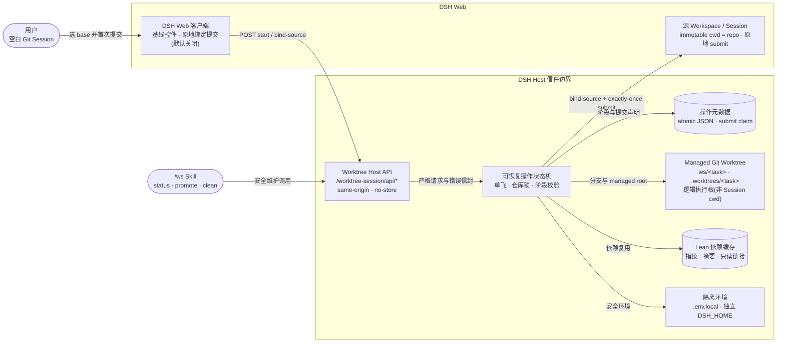
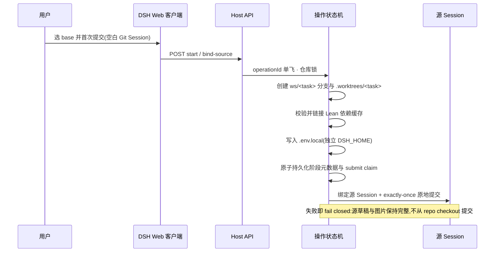
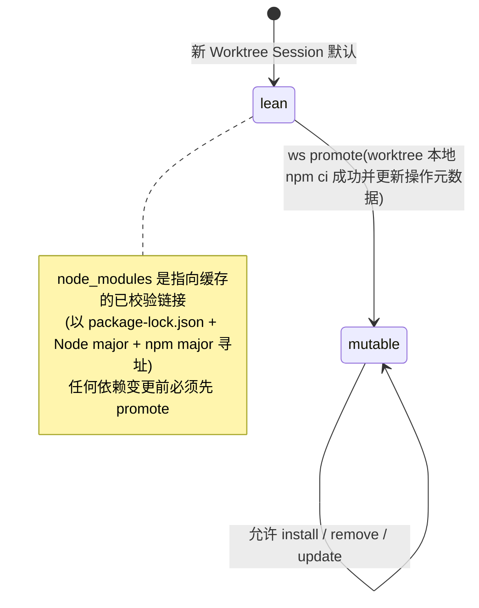
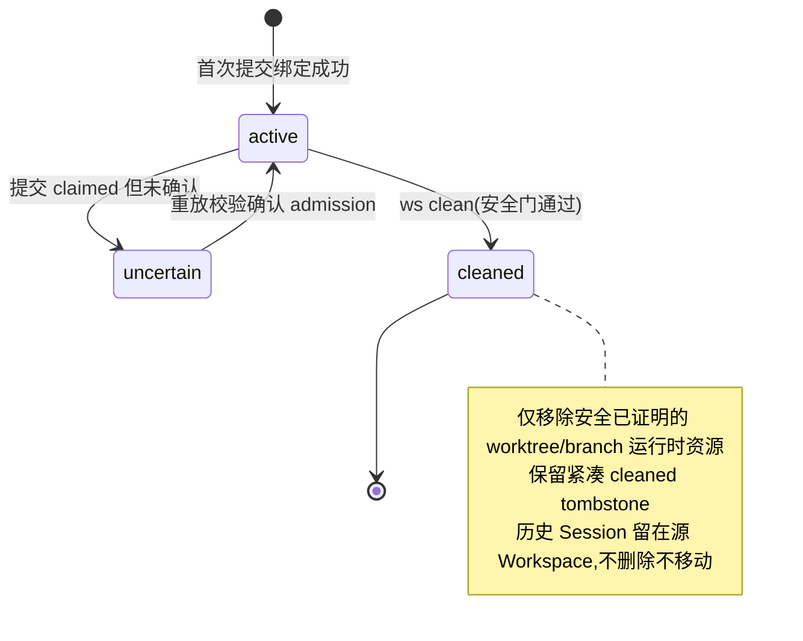

# Worktree Session 架构与交互

本文是 Worktree Session(WS)架构的可维护真相源,取代此前生成的
`worktree-session-architecture.html`(及其已过时的 schema-v1 JSON 图源)。
仅支持 **schema v2 source-session 绑定**:一 Git repo 一 DSH Workspace,
首次提交沿源 Session 原地进行,不创建目标 Workspace/Session。
详细契约见 `packages/worktree-session/README.md` 与 `skills/ws/SKILL.md`。

## 组件与信任边界

三条主链路(原交互图的三个视图):

| 视图 | 路径 | 说明 |
| --- | --- | --- |
| 源 Session 原地提交 | 用户 → Web 客户端 → Host API → 操作状态机 → 源 Session | 空白 Git Session 准备 worktree、原地绑定并沿同一源 Session 提交;不创建目标 Workspace/Session。 |
| 隔离资源准备 | 操作状态机 → Git worktree / Lean 缓存 / 隔离环境 / 操作元数据 | 仓库锁内依次创建、校验并持久化可恢复资源;逻辑执行根是 `.worktrees/<task>`。 |
| 状态与维护 | /ws Skill 与状态 UI → Host API → 操作状态机 → worktree / 缓存 | 状态 UI 与 status/promote/clean 复用 Host 安全边界;默认 lean,promote 后刷新状态。 |

### 客户端交互

- 控件只在空白 Git Session 出现;未开启时沿用普通 submit。
- 源 Session 原地绑定并提交,不创建目标 Workspace/Session;
  文本和图片在绑定提交被接受前保持源草稿完整。
- 输入区状态 UI 持续显示绑定任务分支、依赖模式(`lean`/`mutable`)与
  生命周期(`active`/`uncertain`/`cleaned`);分支名单行省略,hover 显示完整名。
- 点击绑定分支名用本机编辑器打开绑定 worktree
  (默认 `vscode://file/<path>` deep link,打开动作可配置);
  cleaned 或未绑定的 Session 不提供打开动作,目标路径始终来自持久化绑定。

### 安全约束

- Git 一律以 argv 方式执行,从不切换、重置或复用主 checkout 作为任务根。
- Host API same-origin、no-store,严格请求校验与错误信封。
- 依赖缓存带指纹、摘要与只读保护。
- clean 拒绝当前使用中、脏、in-flight、active 绑定或未证明合并的 worktree。

## 首次提交与可恢复操作

- 操作记录持久化在 `<git-common-dir>/ws/operations/<operationId>.json`,
  保存源 Session 绑定、规范仓库、managed worktree、任务分支、admission 状态与依赖元数据。
- 重复的首次提交重试复用同一 operationId 与已准备资源;
  `prepared` 阶段重放会重新校验并修复资源。
- 已声明(claimed)但未确认的提交进入 `uncertain`,不会被自动再次提交。
- Host 重启或 Session resume 会在继续本地执行前重新校验同一绑定。

## 依赖模式(lean / mutable)与 promote

- promote 由 Agent 驱动,保持 Session 绑定不变;
  只更新元数据与 UI 状态,不改变稳定模型运行时上下文。
- 稳定上下文只含持久不变式(仓库根、managed 根、任务分支、主 checkout 禁令、
  显式路径规则、依赖变更前 promote);动态状态走元数据/UI 或按需 status。

## 生命周期与清理

清理(`ws clean`,模型面向当前调用 Session;`dsh-ws` CLI 面向显式路径,
供操作员恢复与诊断,先 `--dry-run`):

- 拒绝当前使用中、脏、未合并、active 绑定或 in-flight 的 worktree;
  从不删除远端分支或共享 npm 缓存;绝不越过安全拒绝强制清理。
- 成功清理保留 cleaned tombstone 与源 Workspace 下的历史 Session。

## 普通 Session 恢复(cleaned 历史 Session)

- 当前实现中，清理后重新打开历史 Session 会提示旧执行根已被清理、拒绝复用被移除的路径，并引导创建新的 Worktree Session（fail closed，不复活旧绑定）。
- 活跃变更 `restore-cleaned-session-as-ordinary` 将在用户归档后再取消归档时，把 cleaned 历史 Session 转为普通源 Workspace Session：解除运行时 WS 约束但保留审计 tombstone，不自动创建 worktree，仍不支持非空白 Session 触发 `ws start`。
- 孤儿操作:用 `dsh-ws status <worktree>` 检查并保留/提交有用工作;
  破坏性清理要求有效的 schema-v2 source-session 绑定,
  未绑定或格式损坏的记录 fail closed,需操作员显式修复。
- schema-v1 或未知版本操作记录在读取时被显式拒绝:不创建、修改或删除任何
  worktree、分支、绑定、依赖或操作文件,也不迁移或伪造绑定。
- 历史 Session 日志与既有 Workspace/Session 注册保持独立且不受影响;
  清理安全 Git 资源从不意味着删除或重挂历史 DSH Workspace/Session 注册或历史。
- 上述普通 Session 恢复语义由活跃变更 `restore-cleaned-session-as-ordinary` 跟踪；实现落地后，本节应从“计划”更新为最终行为与验证结果。
